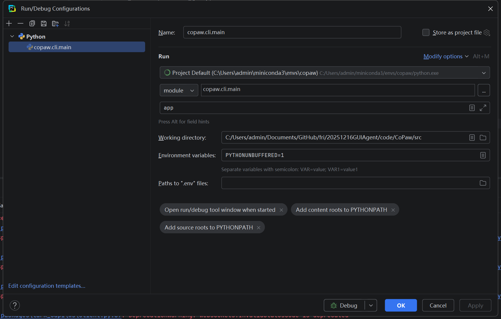

# 创建window conda 环境

```powershell
conda create -n copaw python=3.11
conda activate copaw
git clone https://github.com/agentscope-ai/CoPaw.git
cd CoPaw
cd console
npm ci
npm run build
cd ..
mkdir -p src/copaw/console
cp -R console/dist/. src/copaw/console/
pip install -e .
# 若执行 pip install -e ".[dev,full]" 则报错 llama-cpp-python 构建失败。所以不执行该命令，毕竟这不是必选项
pip uninstall -y copaw
conda pack -n copaw -o copaw_env.tar.gz
```

# 关键点

内网要用
```
pip install -e . --no-build-isolation --no-index --no-deps
```
命令才行

# 调试

关键点：

且 main.py 最后要加上：

```python
if __name__ == "__main__":
    cli()
```

关键点：要先在命令行执行一遍如下命令，才能调试成功：
```bash
copaw init --defaults
copaw app
```

此时可以成功调试。

复现内网错误：

```python
import asyncio
import os
from openai import AsyncOpenAI, APIError

# --- 配置你的内网参数 ---
BASE_URL = "https://你的内网地址/v2"  # 替换成你代码里的 self.base_url
API_KEY = "sk-xxxxxxxx"            # 替换成你的 key

async def test_connection():
    # 初始化客户端
    client = AsyncOpenAI(
        base_url=BASE_URL,
        api_key=API_KEY,
        timeout=5.0
    )
    models = await client.models.list()


if __name__ == "__main__":
    asyncio.run(test_connection())
```

果然最小代码没跑通。

openai调用：

```python
from openai import OpenAI

client = OpenAI(
    base_url=xxx, 
    api_key=xxx
)

# 2. 发起请求
response = client.chat.completions.create(
    model=xxx,  # 必须与你本地运行的模型名称一致
    messages=[
        {"role": "system", "content": "你是一个有用的助手。"},
        {"role": "user", "content": "你好，请用一句话介绍你自己。"}
    ]
)

# 3. 打印结果
print(response.choices[0].message.content)
```

也是通的。

通过询问建诚得知，内网模型没有 base_url/models 这个功能，因为当时部署时是单个单个模型部署的。