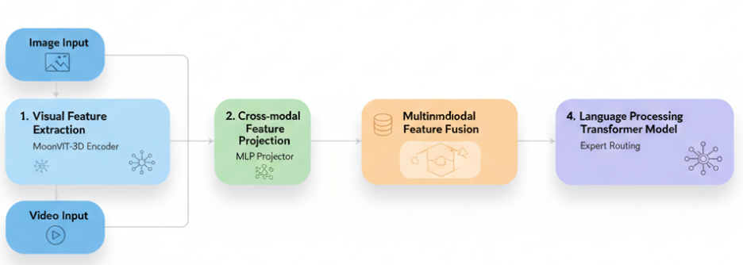
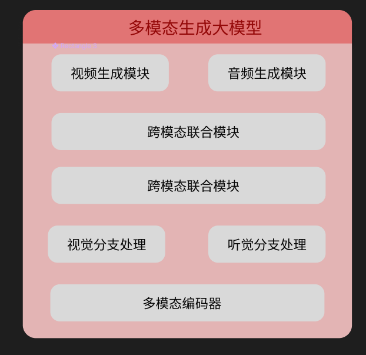
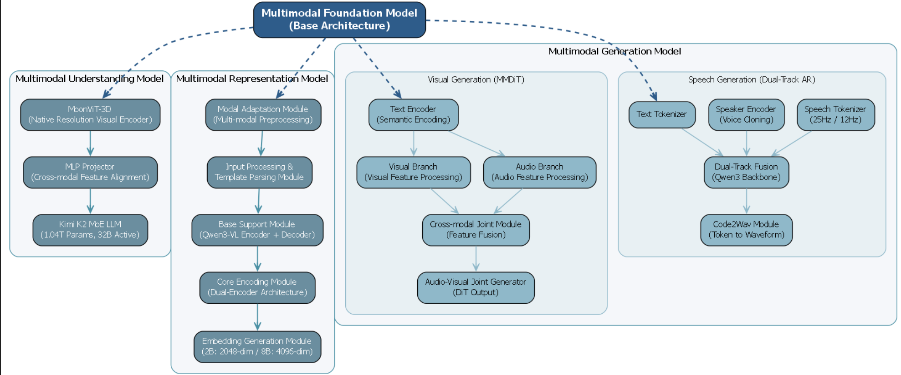
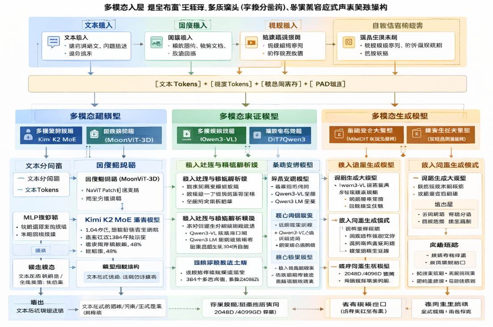
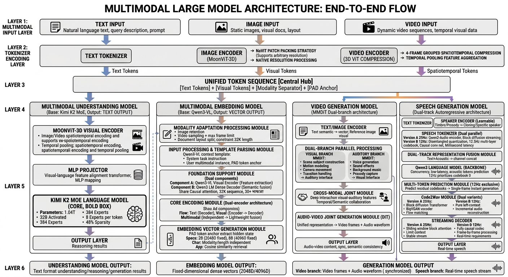

# 思路一：根据参考图，生成图片

grok: 速度快，但内容不如chatgpt丰富

chatgpt：中文鬼画符。但英文效果很好

# 思路二：根据参考图，用前端复刻

# 思路三：根据参考图，生成提示词，再根据提示词生成图片

# 思路四：Figma AI

gemini 说参考图用 figma 生成最合适。

figma 有AI生成功能，其原理是代码生成 tsx 文件。

手绘效果：又慢又丑

# 思路五：根据文档生成python图

- 根据该文件，采用python的graphviz，绘制科研用的框图。
- 只生成一个图，总体框架为“多模态基础大模型”，具备三个部分：多模态理解大模型，多模态表征大模型，多模态生成大模型
- 用英文，不要出现中文

# 思路六：根据文档生成绘制提纲，再让AI生图

这个最好的结果是由 openrouter 中的 nanobanana2 生成的，提示词为：英文作图提纲。

要附上 参考图.png