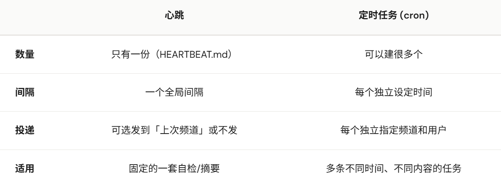

# 实验背景

我要用copaw调用行人违章。

其实是要用copaw创建行人违章应用。创建成功后返回链接？

定时任务？适用场景：运行纯粹的python

copaw中的定时任务/心跳什么意思？
- 「心跳」在 CoPAW 里指的是：按固定间隔，用你写好的一段「问题」去问 CoPAW，并可选择把 CoPAW 的回复发到你上次对话的频道。https://copaw.agentscope.io/docs/heartbeat



# 定时任务

https://copaw.agentscope.io/docs/cli

```powershell
copaw cron create \
  --agent-id abc123 \
  --type agent \
  --name "检查待办" \
  --cron "0 */2 * * *" \
  --channel dingtalk \
  --target-user "你的用户ID" \
  --target-session "会话ID" \
  --text "我有什么待办事项？"
```
必填：--type、--name、--cron、--channel、--target-user、 --target-session、--text。

## cron 参数

每一分钟：`*/1 * * * *`

## 定时任务的应用

先执行python。该python是一个持续的程序，将结果源源不断写入一个txt。定时任务每1分钟读取该txt，将新增内容打印出来。

text：检查xx.py对应的日志文件是否是否存在。如果是，根据已打印行号，输出日志文件。将行数写入已打印行号。如果否，则运行xx.py
- 整个逻辑也包到python中？问题：copaw每次调用这个python，操作系统每次都会启动一个全新的 Python 进程。
- 在你的 Python 脚本里开一个极轻量级的 HTTP 接口：见《stream_output.py》

## 问题：定时任务无输出渠道

channel如果是飞书之类的，则无法配置。channel如果是控制台，则定时任务的返回结果只是一个几秒就消失的popup。因此，还得是用心跳任务？？？

# 心跳任务

## HEARTBEAT.md

```text
# 周期性系统巡检任务

1. **检查 Python 业务程序运行状态**：
   - 请通过 HTTP GET 请求 `http://127.0.0.1:5050/get_incremental` 获取最新增量 JSON 数据。
   - 如果返回的 `count` 为 0，说明业务正常但无新进展，此项你不需要向我汇报。
   - 如果有新内容 (`new_logs` 有数据)，请帮我提炼总结其中的关键信息（特别是包含 Error 或失败的记录，必须高亮）。
```

## ~/.copaw/config.json

```json
"agents": {
  "defaults": {
    "heartbeat": {
      "every": "1min",
      "target": "main"
    }
  }
}
```

## 分析

可行。只是需要手动刷新前端界面。