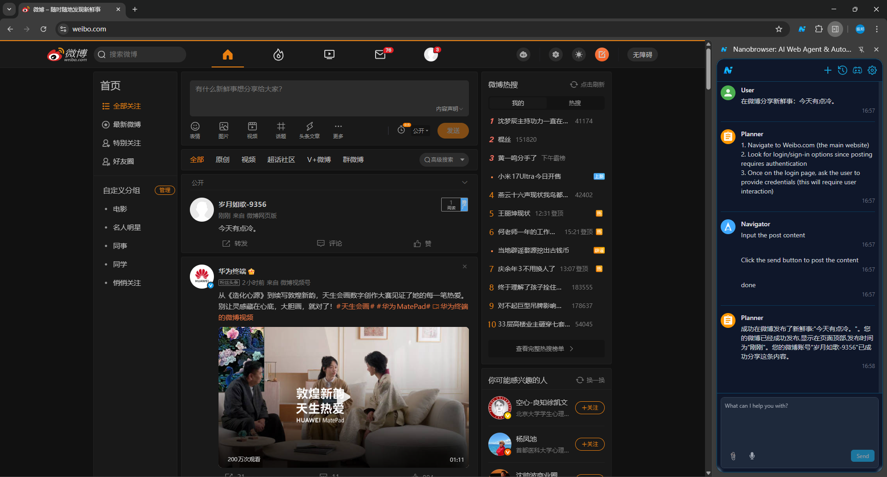

# 实验背景

经上次与同事讨论，我意识到一个问题：现在已经验证了可以进行浏览器自动化。可是，用户怎么使用呢？难道向我一样打开命令行写命令么？肯定不行。有个方向是 ai browser。研究一下。

# 实验目的

调研 AI Browse

# 实验步骤

## 调研 ChatGPT Atlas

- https://openai.com/zh-Hans-CN/index/introducing-chatgpt-atlas/
- 出品方：OpenAI
- 推出时间：2025年10月21日
- 可用性：仅macos。闭源。

## 调研 Disco

- https://labs.google/disco/
- Slogan: Discovering the next great AI features for the web
- 出品方：Google Labs
- 推出时间：2025年12月
- 可用性：不可用。只能填写候补名单。

## 调研 nanobrowser

我是如何发现的？
- 在谷歌上搜索 Agentic Browser
- 进入 reddit
- 看到 nanobrowser

我发现它是一个浏览器插件。于是我在插件市场搜索automation，出现很多类似插件。

可用性：https://github.com/nanobrowser/nanobrowser

## 调研 BrowserOS

- https://github.com/browseros-ai/BrowserOS
- Slogan: The open-source Agentic browser; privacy-first alternative to ChatGPT Atlas, Perplexity Comet, Dia.
- 是 ChatGPT Atlas, Perplexity Comet, Dia 的开源平替
- 可用性：可以安装windows/ubuntu应用程序

### 能力测试

#### 点击指定按钮

成功

#### 在百度百科搜索武林外传

成功

#### 根据自然语言指令登录 ai studio

- 进入 谷歌 的 aistudio：成功
- 点击 get started：成功
- 填写 lizhenbang56@foxmail.com：成功
- 点击下一步：失败（点成了旁边的创建账户）
- 点击按钮 下一步：失败（点成了旁边的创建账户）
- 输入 425731：成功
- 点击 got it：成功
- 关闭 grounding with google search 选项：成功

#### 根据自然语言指令查询车票

- 进入12306：成功
- 查询明天从北京到上海的火车票：失败。处理下拉列表时失效。这不怪它，我早有心理准备。首先，我的描述很短。其次，12306的交互逻辑很奇葩。

#### 自助攒机

- 为我配置装机方案：失败。不知道为什么我明明登录了，agent刷新了一下，登录信息就消失了。而且不知道agent点击了哪里，莫名其妙跳转到了微信扫码登录界面

#### 跳转网站

## 对 BrowserOS 的评价

我确信这就是我需要的产品。相比于在命令行执行，这样的优势是：
- 就是因为这不是命令行，这一点就足够了。给用户的不是命令行，而是一个浏览器，这足够了。

## 调研有没有比 BrowserOS 更好的开源 AI Browser

推荐类似于 ChatGPT Atlas, BrowserOS, Perplexity Comet, AI Lab Disco, Dia 之类的 AI Browser（要求开源）
- gemini（没联网）：回答不尽人意
- google ai mode: 没有更好推荐
- kimi：没有更好推荐

综上所述，BrowserOS 就是我的选择

## 制作PPT

我需要证明为什么要采用它，它有什么好处。

### 确认逻辑

#### 现有方案
- 安装 python 环境
- 安装 pip 包
- 写python代码
- 命令行执行python代码
- python代码调用浏览器执行自动化操作

#### 未来方案

- 安装浏览器
- 在浏览器中直接执行自动化操作

### 什么是AI浏览器

- 是浏览器
- 绝不是仅仅植入了一个chat插件的浏览器
- 核心功能是根据自然语言自动操作网页

### AI浏览器发展现状

见前述调研结果

### 长什么样子

要有截图

# 实验结果

明确了采用 nanobrowser。明确了要在实验31中做一页PPT