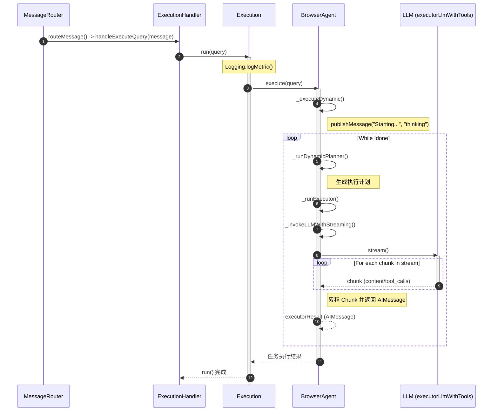

```typescript
webpack://Agent/src/background/router/MessageRouter.ts
    routeMessage()
        handler(message)  // 调用 webpack://Agent/src/background/handlers/ExecutionHandler.ts/handleExecuteQuery()

webpack://Agent/src/background/handlers/ExecutionHandler.ts
    handleExecuteQuery()
        this.execution.run(query)  // 调用 webpack://Agent/src/lib/execution/Execution.ts/run()

webpack://Agent/src/lib/execution/Execution.ts
    run()
        Logging.logMetric()
        browseAgent.execute(query)  // 调用webpack://Agent/src/lib/agent/BrowserAgent.ts/execute()

webpack://Agent/src/lib/agent/BrowserAgent.ts
    execute()
        _executeDynamic()  // 调用webpack://Agent/src/lib/agent/BrowserAgent.ts/_executeDynamic()

webpack://Agent/src/lib/agent/BrowserAgent.ts
    _executeDynamic()
        this._publishMessage("Starting task execution...", "thinking");
        while (!done)
            planResult = this._runDynamicPlanner()
            executorResult = this._runExecutor()  // 调用webpack://Agent/src/lib/agent/BrowserAgent.ts/_runExecutor()

webpack://Agent/src/lib/agent/BrowserAgent.ts
    _runExecutor()
        llmResponse = await this._invokeLLMWithStreaming()  // 生成可执行的动作。调用webpack://Agent/src/lib/agent/BrowserAgent.ts/_invokeLLMWithStreaming()

webpack://Agent/src/lib/agent/BrowserAgent.ts
    _invokeLLMWithStreaming()
        stream = await this.executorLlmWithTools.stream()  // 调用大模型
        for await (const chunk of stream)
            accumulatedChunk = accumulatedChunk.concat(chunk)
        return new AIMessage({
            content: accumulatedChunk.content,
            tool_calls: accumulatedChunk.tool_calls,  // 默认大模型有原生调用工具的能力。
        });
```

当模型想用工具时，它会输出一个类似 <|call_tool|> 的起始符。API 提供商（如 OpenAI）：当它在后台看到这个特殊标记时，它就不会把后面的字符塞进 content 字段，而是重定向到一个专门的 tool_calls 结构化字段中。（正如推理内容，其实就是被<thinking>包裹的一段文本）

对于有原生工具调用能力的模型，其工具调用相关内容走专门的 tool_calls 频道，与 content 分离。而没有原生工具调用能力的模型，则工具调用相关内容全部挤在 content 频道。

如果模型是那种不支持工具调用的旧模型，代码里一定会出现类似 const regex = /Action: (.*)/ 这样的正则表达式来手动解析文本。

GLM-4.6V：原生支持工具调用。

qwen-plus 既能支持视觉，又支持工具调用。经实验，可以跑通。