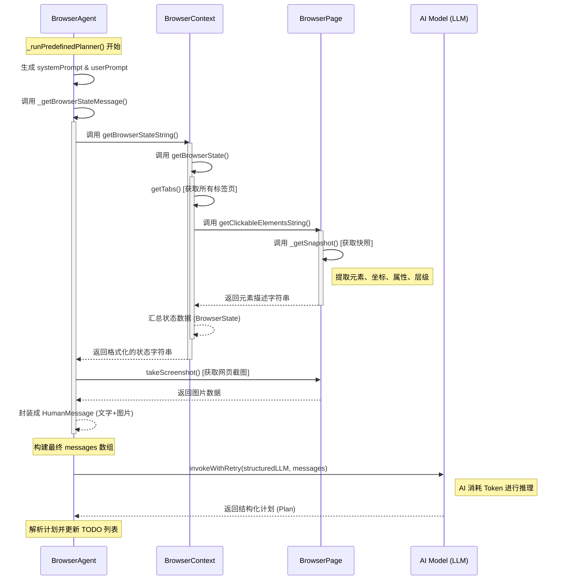

```TypeScript
webpack://Agent/src/lib/agent/BrowserAgent.ts
    _runPredefinedPlanner()  // 调用大模型，生成plan
        const systemPrompt = generatePredefinedPlannerPrompt()
        const structuredLLM = await getStructuredLLM(PredefinedPlannerOutputSchema)
        const userPrompt = `Current TODO List:
            ${currentTodos}

            EXECUTION METRICS:
            - Tool calls: ${metrics.toolCalls} (${metrics.errors} errors, ${errorRate}% failure rate)
            - Observations taken: ${metrics.observations}
            - Time elapsed: ${(elapsed / 1000).toFixed(1)} seconds
            ${parseInt(errorRate) > 30 && metrics.errors > 3 ? "⚠️ HIGH ERROR RATE - Current approach may be failing. Learn from the past execution history and adapt your approach" : ""}

            ${executionContext}

            YOUR PREVIOUS STEPS DONE SO FAR (what you thought would work):
            ${fullHistory}
            `;
        const browserStateMessage = this._getBrowserStateMessage()  // 获取浏览器状态，包括截图、打开的标签页、当前网页快照（元素列表、位置、属性）等。调用webpack://Agent/src/lib/agent/BrowserAgent.ts/_getBrowserStateMessage()
        const messages = [
            new SystemMessage(systemPrompt),
            new HumanMessage(userPrompt),
            browserStateMessage
        ];
        const plan = await invokeWithRetry<PredefinedPlannerOutput>(  // 调用大模型，生成plan
            structuredLLM,
            messages,
            MAX_RETRIES,
            { signal: this.executionContext.abortSignal }
        );

webpack://Agent/src/lib/agent/BrowserAgent.ts
    _getBrowserStateMessage()  // 获取浏览器状态，包括截图、打开的标签页、当前网页快照（元素列表、位置、属性）等
        this.executionContext.browserContext.getBrowserStateString()  // 汇总当前浏览器的状态信息，字符串形式，方便大模型读取。调用 webpack://Agent/src/lib/browser/BrowserContext.ts/getBrowserStateString()
        page.takeScreenshot()  // 获取截图

webpack://Agent/src/lib/browser/BrowserContext.ts
    getBrowserStateString()  // 汇总当前浏览器的状态信息，字符串形式，方便大模型读取。
        this.getBrowserState()  // 汇总当前浏览器的所有状态信息。调用 webpack://Agent/src/lib/browser/BrowserContext.ts/getBrowserState()

webpack://Agent/src/lib/browser/BrowserContext.ts
    getBrowserState()  // 汇总当前浏览器的所有状态信息
        this.getTabs()  // 获取当前浏览器一共打开了多少个标签页
        currentPage.getClickableElementsString()  // 获取currentPage网页的可点击元素。调用 webpack://Agent/src/lib/browser/BrowserPage.ts/getClickableElementsString()

webpack://Agent/src/lib/browser/BrowserPage.ts
    getClickableElementsString()  // 获取当前网页的可点击元素
        this._getSnapshot()  // 获取当前网页快照。调用 webpack://Agent/src/lib/browser/BrowserPage.ts/_getSnapshot()

webpack://Agent/src/lib/browser/BrowserPage.ts
    _getSnapshot()
        获取当前网页快照，包含：
            元素列表： 页面上所有的按钮、输入框、链接等。
            位置信息： 每个元素在屏幕上的具体坐标（x, y, 宽, 高）。
            属性： 这个按钮叫什么名字？它是禁用的还是可以点击的？
            层级关系： 哪个元素在哪个元素里面。
```