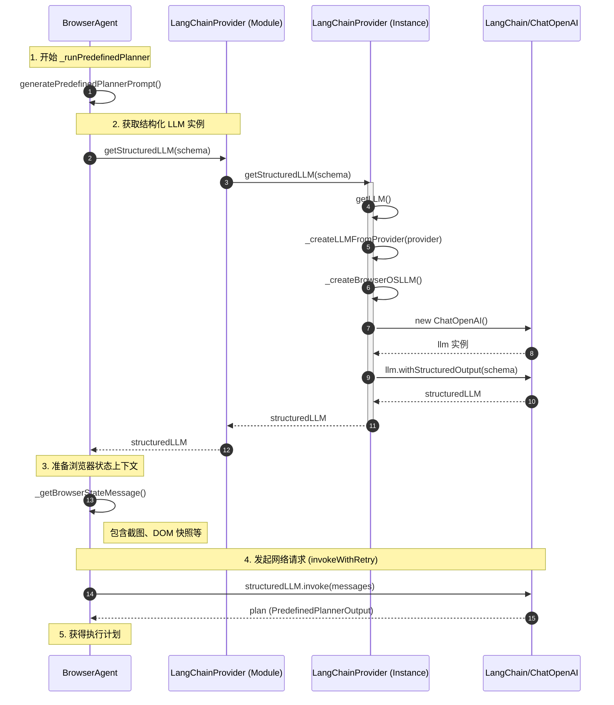

```TypeScript
webpack://Agent/src/lib/agent/BrowserAgent.ts
    _runPredefinedPlanner()  // 调用大模型，生成plan
        const systemPrompt = generatePredefinedPlannerPrompt()
        const structuredLLM = await getStructuredLLM(PredefinedPlannerOutputSchema)  // 调用 webpack://Agent/src/lib/llm/LangChainProvider.ts/getStructuredLLM()
        const userPrompt = `Current TODO List:
            ${currentTodos}

            EXECUTION METRICS:
            - Tool calls: ${metrics.toolCalls} (${metrics.errors} errors, ${errorRate}% failure rate)
            - Observations taken: ${metrics.observations}
            - Time elapsed: ${(elapsed / 1000).toFixed(1)} seconds
            ${parseInt(errorRate) > 30 && metrics.errors > 3 ? "⚠️ HIGH ERROR RATE - Current approach may be failing. Learn from the past execution history and adapt your approach" : ""}

            ${executionContext}

            YOUR PREVIOUS STEPS DONE SO FAR (what you thought would work):
            ${fullHistory}
            `;
        const browserStateMessage = this._getBrowserStateMessage()  // 获取浏览器状态，包括截图、打开的标签页、当前网页快照（元素列表、位置、属性）等。调用webpack://Agent/src/lib/agent/BrowserAgent.ts/_getBrowserStateMessage()
        const messages = [
            new SystemMessage(systemPrompt),
            new HumanMessage(userPrompt),
            browserStateMessage
        ];
        const plan = await invokeWithRetry<PredefinedPlannerOutput>(  // 调用大模型，生成plan
            structuredLLM,
            messages,
            MAX_RETRIES,
            { signal: this.executionContext.abortSignal }
        );

webpack://Agent/src/lib/llm/LangChainProvider.ts
    getStructuredLLM()
        return langChainProvider.getStructuredLLM()  // 调用 webpack://Agent/src/lib/llm/LangChainProvider.ts/LangChainProvider/getStructuredLLM()

webpack://Agent/src/lib/llm/LangChainProvider.ts
    class LangChainProvider:
        getStructuredLLM()
            llm = this.getLLM()  // 调用 webpack://Agent/src/lib/llm/LangChainProvider.ts/LangChainProvider/getLLM()
            return llm.withStructuredOutput(schema)  // 让大模型输出结构化数据。调用langchain/openai/ChatOpenAI/withStructuredOutput()

webpack://Agent/src/lib/llm/LangChainProvider.ts
    class LangChainProvider:
        getLLM()
            llm = this._createLLMFromProvider(provider)  // 调用webpack://Agent/src/lib/llm/LangChainProvider.ts/LangChainProvider/_createLLMFromProvider()

webpack://Agent/src/lib/llm/LangChainProvider.ts
    class LangChainProvider:
        _createLLMFromProvider()
            _createBrowserOSLLM()  // 调用webpack://Agent/src/lib/llm/LangChainProvider.ts/LangChainProvider/_createBrowserOSLLM()

webpack://Agent/src/lib/llm/LangChainProvider.ts
import { ChatOpenAI } from "@langchain/openai"
    class LangChainProvider:
        _createBrowserOSLLM()
            model = new ChatOpenAI()  //调用langchain/openai/ChatOpenAI
```