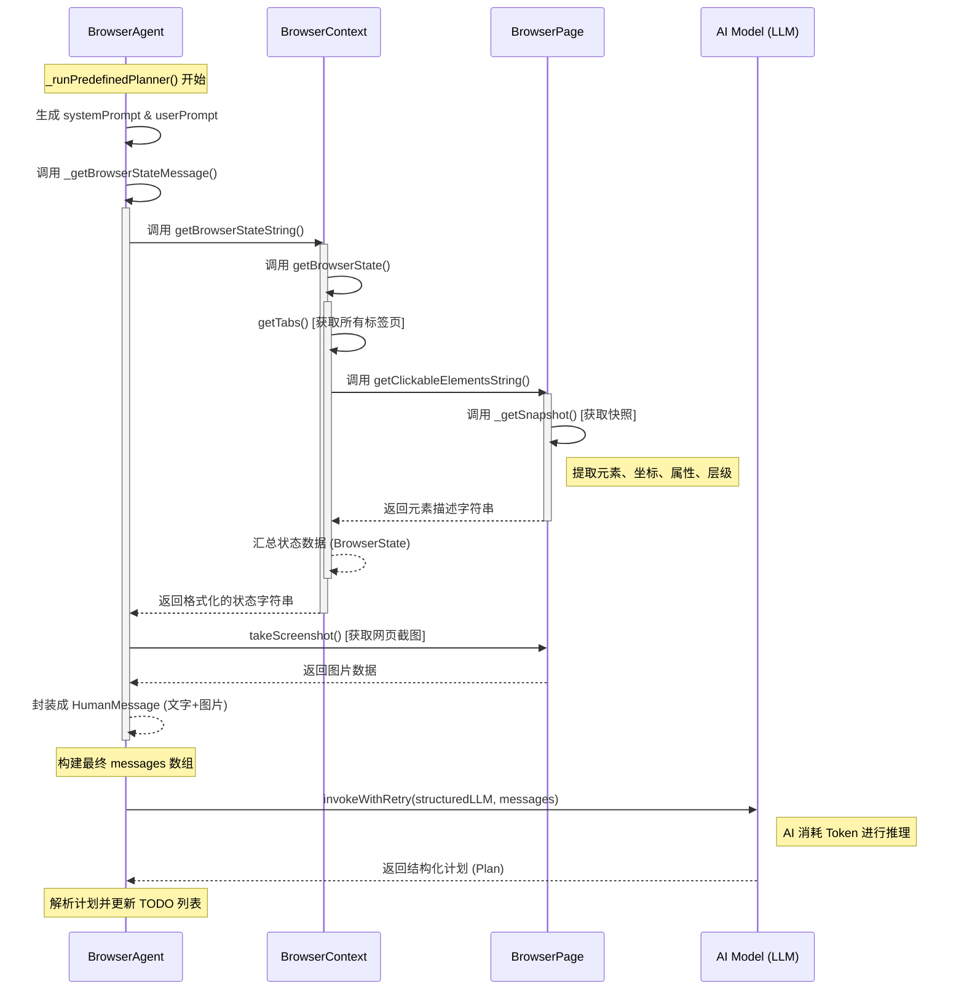

## 概述

通过将复杂的原始HTML重构为结构化的页面语义快照，可为AI Agent提供具备逻辑一致性的页面状态描述。通过筛选具备交互能力的DOM元素并赋予其唯一索引编号，将非结构化的源码转化为包含功能类型与文本信息的精简条目，从而建立起感知结果与操作指令之间的直接关联。这种处理方式排除了网页中的冗余噪声，将复杂的文档结构降维映射为可供决策的动作空间，使得AI Agent能够根据逻辑编号识别并操作页面元素。这种基于语义提取的感知设计，在降低输入数据复杂度的同时，确保了感知环节与执行环节的逻辑对齐，为实现在动态网页环境下的任务执行提供了具体的实现路径。

## 页面语义快照

```html
<browser-state>
    BROWSER STATE:
    Current tab: {id: 817055687, url: chrome://newtab/, title: BrowserOS}
    Elements:
    Clickable:
        [1] <C> <div> (visible)
        [2] <C> <button> \"Current theme: System\" (visible)
        [4] <C> <button> (visible)
        [5] <C> <button> \"Tabs\" (visible)
        [6] <C> <a> \"Settings - BrowserOS Settings - Brows...\" (visible)
        [7] <C> <a> \"                                     ...\" (visible)
        [8] <C> <a> \"               2006                  ...\" (visible)
        [9] <C> <a> \"                                     ...\" (visible)
        [10] <C> <a> \"Onboarding Guide - BrowserOS Document...\" (visible)
        [11] <C> <a> \"Settings\" (visible)
        [12] <C> <button> \"Shortcuts\" (visible)
        [13] <C> <a> \"Connect MCP servers (new)\" (visible)
    Inputs:
        [3] <T> <input> \"Ask AI or search Google...\" (visible)
</browser-state>
```

这段文本是一种专门为 **AI Agent（人工智能代理）** 设计的**页面语义快照**。它将复杂的 HTML 网页简化为 AI 能够理解的结构化指令列表。

我们可以将其解析为以下四个主要部分：

### 1. 容器外壳 (Container)
*   **`<browser-state>` ... `</browser-state>`**：这是标签化的界定符，告诉 AI 这是一个当前浏览器的实时状态报告，类似于编程中的作用域。

### 2. 元数据头部 (Header Metadata)
*   **`Current tab`**：描述当前活动标签页的信息。
    *   **`id`**: 浏览器的内部唯一标识符（817055687）。
    *   **`url`**: `chrome://newtab/`（说明当前在“新标签页”）。
    *   **`title`**: `BrowserOS`（页面标题）。

### 3. 元素分类区 (Categorized Sections)
文本根据功能将网页元素分成了两大类：
*   **`Clickable:`（可点击元素）**：包含按钮、链接和可交互的层（div）。
*   **`Inputs:`（输入元素）**：专门列出可以输入文字的文本框或搜索框。

### 4. 元素描述语法 (Element Syntax)
这是最核心的部分，每一个条目（如 `[6] <C> <a> "Settings..." (visible)`）都遵循固定的格式：

| 组成部分 | 示例 | 含义 |
| :--- | :--- | :--- |
| **索引编号** | `[6]` | **最重要**。AI 通过发送指令如 `click(6)` 来操作该元素。 |
| **功能类型** | `<C>` / `<T>` | 缩写代号。`<C>` 代表 Clickable（可点击），`<T>` 代表 Typeable（可输入）。 |
| **HTML 标签** | `<a>` / `<button>` | 原始 HTML 标签，帮助 AI 理解元素的性质（链接、按钮等）。 |
| **可见文本** | `"Settings..."` | 元素上显示的文字或描述，AI 靠它识别功能逻辑。 |
| **状态状态** | `(visible)` | 确认该元素在当前视口中是否真实可见。 |

---

### 解析示例：
以其中一行代码为例：
`[13] <C> <a> "Connect MCP servers (new)" (visible)`

1.  **编号 [13]**：AI 如果想连接服务器，就要针对 13 号进行操作。
2.  **类型 `<C>`**：这是一个可以点击的交互项。
3.  **标签 `<a>`**：它在代码里是一个超链接。
4.  **文本 "Connect MCP servers (new)"**：这是用户在屏幕上看到的字。
5.  **状态 (visible)**：该链接目前显示在屏幕上，没有隐藏。

### 这种结构的用途：
*   **节省空间**：比原始 HTML 代码减少了 90% 以上的体积，只给 AI 提供最有用的交互信息。
*   **坐标无关**：AI 不需要知道元素在屏幕的具体像素坐标，只需要知道编号即可发送操作指令。
*   **语义强化**：通过提取按钮文字，直接告诉 AI 这个元素是干什么用的。

## 序列图



# 代码调用流程

```TypeScript
webpack://Agent/src/lib/agent/BrowserAgent.ts
    _runPredefinedPlanner()  // 调用大模型，生成plan
        const systemPrompt = generatePredefinedPlannerPrompt()
        const structuredLLM = await getStructuredLLM(PredefinedPlannerOutputSchema)
        const userPrompt = `Current TODO List:
            ${currentTodos}

            EXECUTION METRICS:
            - Tool calls: ${metrics.toolCalls} (${metrics.errors} errors, ${errorRate}% failure rate)
            - Observations taken: ${metrics.observations}
            - Time elapsed: ${(elapsed / 1000).toFixed(1)} seconds
            ${parseInt(errorRate) > 30 && metrics.errors > 3 ? "⚠️ HIGH ERROR RATE - Current approach may be failing. Learn from the past execution history and adapt your approach" : ""}

            ${executionContext}

            YOUR PREVIOUS STEPS DONE SO FAR (what you thought would work):
            ${fullHistory}
            `;
        const browserStateMessage = this._getBrowserStateMessage()  // 获取浏览器状态，包括截图、打开的标签页、当前网页快照（元素列表、位置、属性）等。调用webpack://Agent/src/lib/agent/BrowserAgent.ts/_getBrowserStateMessage()
        /* type(browserStateMessage): json
        {
            "lc": 1,
            "type": "constructor",
            "id": [
                "langchain_core",
                "messages",
                "HumanMessage"
            ],
            "kwargs": {
                "content": [
                    {
                        "type": "text",
                        "text": "<browser-state>BROWSER STATE:\nCurrent tab: {id: 817055687, url: chrome://newtab/, title: BrowserOS}\n\nElements:\nClickable:\n[1] <C> <div> (visible)\n[2] <C> <button> \"Current theme: System\" (visible)\n[4] <C> <button> (visible)\n[5] <C> <button> \"Tabs\" (visible)\n[6] <C> <a> \"Settings - BrowserOS Settings - Brows...\" (visible)\n[7] <C> <a> \"                                     ...\" (visible)\n[8] <C> <a> \"               2006                  ...\" (visible)\n[9] <C> <a> \"                                     ...\" (visible)\n[10] <C> <a> \"Onboarding Guide - BrowserOS Document...\" (visible)\n[11] <C> <a> \"Settings\" (visible)\n[12] <C> <button> \"Shortcuts\" (visible)\n[13] <C> <a> \"Connect MCP servers (new)\" (visible)\n\nInputs:\n[3] <T> <input> \"Ask AI or search Google...\" (visible)</browser-state>"
                    },
                    {
                        "type": "image_url",
                        "image_url": {
                            "url": "data:image/png;base64,iVBORw0KG...此处已缩减过长Base64内容...mCC"
                        }
                    }
                ],
                "additional_kwargs": {
                    "messageType": "browser_state"
                },
                "response_metadata": {}
            }
        }
        */
        const messages = [
            new SystemMessage(systemPrompt),
            new HumanMessage(userPrompt),
            browserStateMessage
        ];
        const plan = await invokeWithRetry<PredefinedPlannerOutput>(  // 调用大模型，生成plan
            structuredLLM,
            messages,
            MAX_RETRIES,
            { signal: this.executionContext.abortSignal }
        );

webpack://Agent/src/lib/agent/BrowserAgent.ts
    _getBrowserStateMessage()  // 获取浏览器状态，包括截图、打开的标签页、当前网页快照（元素列表、位置、属性）等
        this.executionContext.browserContext.getBrowserStateString()  // 汇总当前浏览器的状态信息，字符串形式，方便大模型读取。调用 webpack://Agent/src/lib/browser/BrowserContext.ts/getBrowserStateString()
        page.takeScreenshot()  // 获取截图

webpack://Agent/src/lib/browser/BrowserContext.ts
    getBrowserStateString()  // 汇总当前浏览器的状态信息，字符串形式，方便大模型读取。
        this.getBrowserState()  // 汇总当前浏览器的所有状态信息。调用 webpack://Agent/src/lib/browser/BrowserContext.ts/getBrowserState()

webpack://Agent/src/lib/browser/BrowserContext.ts
    getBrowserState()  // 汇总当前浏览器的所有状态信息
        this.getTabs()  // 获取当前浏览器一共打开了多少个标签页
        currentPage.getClickableElementsString()  // 获取currentPage网页的可点击元素。调用 webpack://Agent/src/lib/browser/BrowserPage.ts/getClickableElementsString()

webpack://Agent/src/lib/browser/BrowserPage.ts
    getClickableElementsString()  // 获取当前网页的可点击元素
        this._getSnapshot()  // 获取当前网页快照。调用 webpack://Agent/src/lib/browser/BrowserPage.ts/_getSnapshot()

webpack://Agent/src/lib/browser/BrowserPage.ts
    _getSnapshot()
        获取当前网页快照，包含：
            元素列表： 页面上所有的按钮、输入框、链接等。
            位置信息： 每个元素在屏幕上的具体坐标（x, y, 宽, 高）。
            属性： 这个按钮叫什么名字？它是禁用的还是可以点击的？
            层级关系： 哪个元素在哪个元素里面。
```