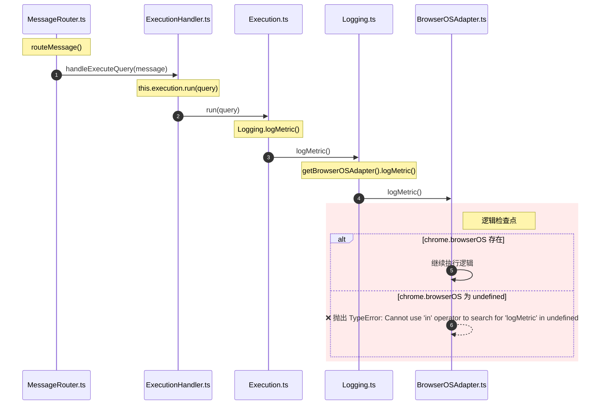

```TypeScript
webpack://Agent/src/background/router/MessageRouter.ts
    routeMessage()
        handler(message)  // 调用 webpack://Agent/src/background/handlers/ExecutionHandler.ts/handleExecuteQuery()

webpack://Agent/src/background/handlers/ExecutionHandler.ts
    handleExecuteQuery()
        this.execution.run(query)  // 调用 webpack://Agent/src/lib/execution/Execution.ts/run()

webpack://Agent/src/lib/execution/Execution.ts
    run()
        Logging.logMetric()  // 调用 webpack://Agent/src/lib/utils/Logging.ts/logMetric()

webpack://Agent/src/lib/utils/Logging.ts
    logMetric()
        getBrowserOSAdapter().logMetric()  // 调用 webpack://Agent/src/lib/browser/BrowserOSAdapter.ts/BrowserOSAdapter/logMetric()
        
webpack://Agent/src/lib/browser/BrowserOSAdapter.ts
    class BrowserOSAdapter
        logMetric()
            if ("logMetric" in chrome.browserOS)  // 若使用通用浏览器，则 chrome.browserOS 为 undefined，xxx in undefined 是语法错误。
                ...
```