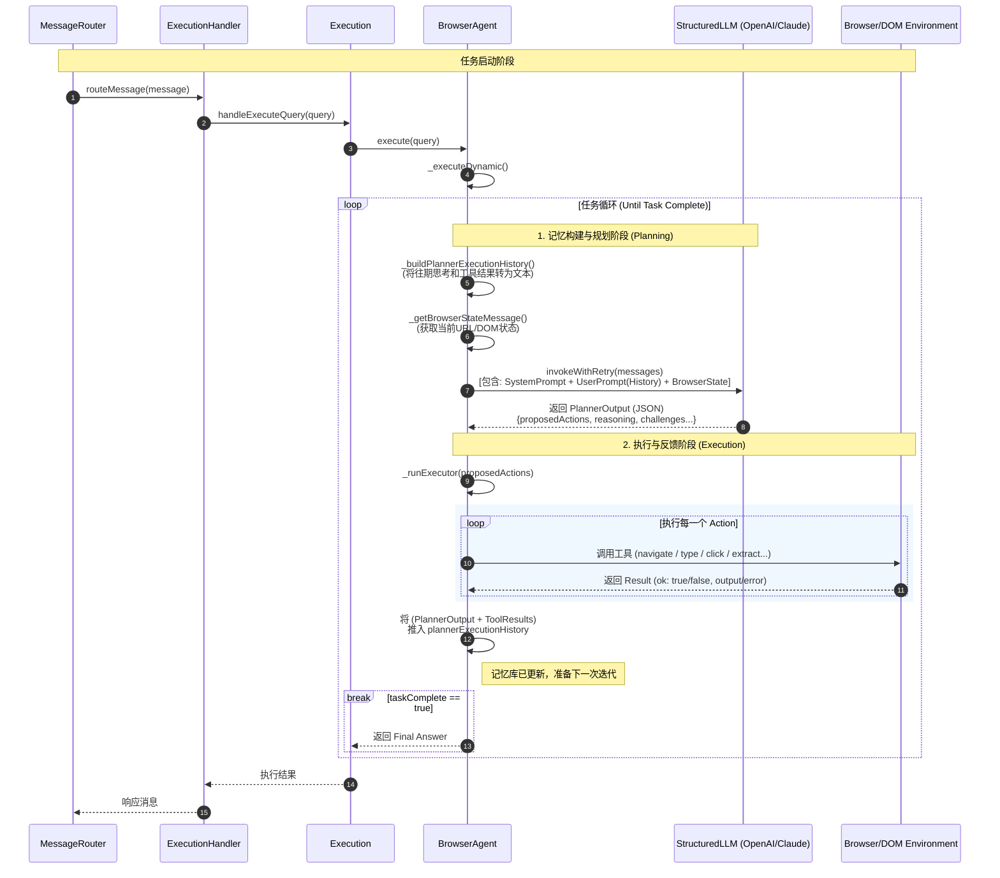

## 1. 概述 (Overview)
在复杂的 Web 自动化任务中，Agent 需要具备在多轮迭代中保持状态一致、学习错误教训以及根据环境反馈调整计划的能力。本 Agent 采用了一种**基于迭代周期的结构化上下文记忆机制**，将“规划-执行-反馈”闭环转化为可被大模型（LLM）理解的结构化历史，从而实现复杂的长路径任务处理。

## 2. 记忆架构设计 (Memory Architecture)

### 2.1 核心存储：`plannerExecutionHistory`
Agent 的记忆并非简单的对话记录，而是一个结构化的对象数组。每个索引代表一个 **Iteration（迭代周期）**。
- **存储位置**: `BrowserAgent` 类的私有属性。
- **组成部分**:
    - **Planner Output**: 模型在当前轮次生成的思考过程（任务理解、当前状态、识别的挑战、推理逻辑、拟定动作）。
    - **Tool Executions**: 执行器（Executor）实际运行工具后的反馈结果（成功标志、输出内容或错误信息）。

### 2.2 记忆转化：文本化映射 (`_buildPlannerExecutionHistory`)
由于模型通过 Text-based 窗口接收信息，系统会将内存中的结构化历史通过模板序列化为易读的文本：
```text
=== ITERATION N ===
PLANNER OUTPUT: [任务目标、当前状态、挑战点、推理过程、拟定动作]
TOOL EXECUTIONS: [工具名1 - 结果, 工具名2 - 错误信息...]
```

## 3. 记忆内容的关键维度 (Key Dimensions of Memory)

Agent 在每一轮迭代中会强制记录并回顾以下五个关键维度，确保记忆的连贯性：

| 维度 | 描述 | 作用 |
| :--- | :--- | :--- |
| **Current State** | 当前浏览器 URL 及页面概况 | 建立空间感，定位当前所处位置 |
| **Execution History** | 过去已完成步骤的总结 | 避免陷入“重复执行”的死循环 |
| **Challenges Identified** | 识别到的困难（如 Vision API 缺失、搜索无结果） | 促使模型在下一轮尝试绕路或纠错 |
| **Reasoning** | 为什么要做当前决定 | 建立因果链条，增强逻辑稳定性 |
| **Proposed Actions** | 具体的工具调用指令 | 将逻辑转化为具体的执行计划 |

## 4. 记忆驱动的反馈循环 (The Feedback Loop)

### 4.1 执行度量 (Metrics Injection)
除了文本历史，记忆机制还引入了**动态度量衡**（Execution Metrics）。系统会计算：
- 工具调用的成功/失败率。
- 已消耗的时间和观察次数。
- **阈值预警**: 当错误率 > 30% 且错误数 > 3 时，在 User Prompt 中显式注入警告（`⚠️ HIGH ERROR RATE`），强迫模型进入“深度反思模式”。

### 4.2 环境反馈的闭环 (Environment Feedback)
记忆机制的核心价值在于记录 `Tool Executions` 的结果。
*   **示例**: 在本案例中，Iteration 1 尝试使用 `visual_type` 失败（报错：Vision API key not provided）。
*   **记忆效果**: Iteration 2 的 Planner 能够看到这个错误，并在推理逻辑中明确指出：“由于视觉识别工具不可用，我们将依赖标准浏览器自动化工具”。

## 5. 记忆注入流程 (Injection Pipeline)

在调用 LLM 之前，`_runDynamicPlanner` 会组装三层记忆上下文：

1.  **System Message**: 定义 Agent 的身份、可调用的工具集及输出规范。
2.  **Human Message (History & Metrics)**:
    *   当前任务。
    *   实时执行度量（成功率、耗时）。
    *   **Full History**: 由 `_buildPlannerExecutionHistory` 生成的往期所有迭代详情。
3.  **Browser State Message**: 包含当前页面的 DOM 树摘录、Screenshot（如有）和当前 URL。

## 6. 技术优势 (Technical Strengths)

1.  **自愈能力 (Self-Healing)**: 通过将工具报错（Error Message）持久化到历史中，Agent 能在下一轮自动修正参数或更换工具。
2.  **状态防丢失**: 即使在 Amazon 搜索后页面意外重定向回首页，Agent 能通过对比 `Current State` 与 `Execution History` 发现状态回退，并决定重新执行搜索（如案例中 Iteration 3 的逻辑）。
3.  **结构化思考**: 强制要求模型输出 `Challenges Identified` 和 `Reasoning`，这在本质上是 Chain-of-Thought (CoT) 在长记忆流中的应用。

## 7. 序列图（Sequence Diagram）



## 8. 函数调用过程 (Fuction Calling)
```typescript
webpack://Agent/src/background/router/MessageRouter.ts
    routeMessage()
        handler(message)  // 调用 webpack://Agent/src/background/handlers/ExecutionHandler.ts/handleExecuteQuery()

webpack://Agent/src/background/handlers/ExecutionHandler.ts
    handleExecuteQuery()
        this.execution.run(query)  // 调用 webpack://Agent/src/lib/execution/Execution.ts/run()

webpack://Agent/src/lib/execution/Execution.ts
    run()
        Logging.logMetric()
        browseAgent.execute(query)  // 调用webpack://Agent/src/lib/agent/BrowserAgent.ts/execute()

webpack://Agent/src/lib/agent/BrowserAgent.ts
    execute()
        _executeDynamic()  // 调用webpack://Agent/src/lib/agent/BrowserAgent.ts/_executeDynamic()

webpack://Agent/src/lib/agent/BrowserAgent.ts
    _executeDynamic()
        this._publishMessage("Starting task execution...", "thinking");
        while (!done)
            planResult = this._runDynamicPlanner()  // 调用 webpack://Agent/src/lib/agent/BrowserAgent.ts/_runDynamicPlanner()
            plan = planResult.output
            executorResult = this._runExecutor(plan.proposedActions, plan)

webpack://Agent/src/lib/agent/BrowserAgent.ts
    _runDynamicPlanner()
        fullHistory = this._buildPlannerExecutionHistory();  // 调用 webpack://Agent/src/lib/agent/BrowserAgent.ts/_buildPlannerExecutionHistory()
        /*fullHistory: text
        "=== ITERATION 1 ===
        PLANNER OUTPUT:
        - Task: Open amazon.com and order Sensodyne toothpaste
        - Current State: We are currently on https://dub.sh/browseros-launch, which is an informational page about BrowserOS. None of the elements on this page relate to Amazon or purchasing products.
        - Execution History: No actions have been taken yet. This is the initial state.
        - Challenges Identified: The current page is the Y Combinator launch page for BrowserOS, not Amazon. The user wants to order Sensodyne toothpaste from amazon.com, but we are not on the correct website yet.
        - Reasoning: The user's task is to open amazon.com and order Sensodyne toothpaste. Currently, we are on the Y Combinator launch page for BrowserOS, not Amazon. The first step must be to navigate to the correct website - amazon.com. Once we are on Amazon, we can search for Sensodyne toothpaste and proceed with the ordering process. Since no actions have been taken yet, we need to start with navigating to the correct domain.
        - Proposed Actions: Navigate to amazon.com

        TOOL EXECUTIONS:
        Tool: navigate - Result: {"ok":true,"output":"Successfully navigated to https://www.amazon.com"}
        Tool: visual_type - Result: {"ok":false,"error":"Vision API key not provided."}
        Tool: type - Result: {"ok":true,"output":"Successfully typed \"Sensodyne toothpaste\" into element 1 "}
        Tool: visual_click - Result: {"ok":false,"error":"Vision API key not provided."}
        Tool: key - Result: {"ok":true,"output":"Pressed Enter key"}

        === ITERATION 2 ===
        PLANNER OUTPUT:
        - Task: Open amazon.com and order Sensodyne toothpaste
        - Current State: We are on Amazon.com after successfully searching for 'Sensodyne toothpaste'. The search was executed by typing into the main search bar and pressing Enter. We are now presumably on the search results page for Sensodyne toothpaste.
        - Execution History: 1. Navigated to amazon.com
        2. Attempted to use visual_type (failed - no Vision API key)
        3. Successfully typed 'Sensodyne toothpaste' into element 1
        4. Attempted to use visual_click (failed - no Vision API key)
        5. Successfully pressed Enter key
        - Challenges Identified: The visual recognition tools (visual_type, visual_click) failed due to missing Vision API key. However, standard browser automation tools succeeded in navigating to Amazon.com and typing 'Sensodyne toothpaste' into the search field, followed by pressing Enter.
        - Reasoning: We have successfully navigated to Amazon.com and performed a search for 'Sensodyne toothpaste' by typing into the search bar and pressing Enter. The visual recognition tools failed due to lack of Vision API key, but we were able to use standard browser automation tools effectively. We are now likely on the search results page showing various Sensodyne toothpaste options. The next logical steps are to wait for the results to fully load, analyze the product listings, select an appropriate Sensodyne toothpaste, view its details, and add it to the cart. Since we cannot use visual recognition tools, we'll need to rely on standard browser automation to identify and interact with the search results and product elements.
        - Proposed Actions: Wait for the search results page to load, Extract and analyze the search results for Sensodyne toothpaste products, Identify the most relevant Sensodyne toothpaste product listing, Click on the product listing to view details, Add the selected product to cart

        TOOL EXECUTIONS:
        Tool: wait - Result: {"ok":true,"output":"Waited 3 seconds for stability"}
        Tool: extract - Result: {"ok":true,"output":{"products":[]}}

        === ITERATION 3 ===
        PLANNER OUTPUT:
        - Task: Open amazon.com and order Sensodyne toothpaste
        - Current State: We are on the Amazon.com homepage (https://www.amazon.com/) with the main search bar visible. The search for 'Sensodyne toothpaste' needs to be re-executed to reach the correct results page.
        - Execution History: 1. Navigated to amazon.com
        2. Attempted visual_type (failed - no Vision API key)
        3. Successfully typed 'Sensodyne toothpaste' into element 1
        4. Attempted visual_click (failed - no Vision API key)
        5. Pressed Enter key
        6. Waited 3 seconds for stability
        7. Extracted search results (returned empty)
        - Challenges Identified: The current browser state shows that we are back on the Amazon.com homepage, not on the search results page for 'Sensodyne toothpaste'. The previous search attempt did not persist, and we are no longer on the results page. Additionally, the `extract` tool returned an empty product list, indicating that either the search results were not loaded at the time or we navigated away.
        - Reasoning: The user wants to order Sensodyne toothpaste from Amazon.com. We previously navigated to Amazon and attempted a search, but the current state shows we are back on the homepage. This suggests the search session did not persist or we were redirected. The search must be re-performed. The search bar is clearly visible and accessible (node [13]). We will type 'Sensodyne toothpaste' into this field, press Enter to submit, wait for results to load, and then extract the product listings. Since visual recognition tools are unavailable, we rely on standard input and navigation tools. Once we confirm the search results are loaded, we can proceed to select and order a product.
        - Proposed Actions: Type 'Sensodyne toothpaste' into the search bar, Press Enter to submit the search, Wait for the search results to load, Extract the search results to identify Sensodyne toothpaste products

        TOOL EXECUTIONS:
        Tool: type - Result: {"ok":true,"output":"Successfully typed \"Sensodyne toothpaste\" into element 13 "}
        Tool: key - Result: {"ok":true,"output":"Pressed Enter key"}
        Tool: wait - Result: {"ok":true,"output":"Waited 5 seconds for stability"}
        Tool: extract - Result: {"ok":true,"output":{"products":[{"name":"Sensodyne Mint 4 Ounce (Pack of 4)","price":19.41,"rating":0},{"name":"SENSODYNE PRONAMEL Extra Fresh 3.4 Ounce (Pack of 4)","price":0,"rating":0},{"name":"SENSODYNE PRONAMEL Fresh Mint 4 Ounce (Pack of 4)","price":0,"rating":0},{"name":"Sensodyne Mint 3.4 Ounce (Pack of 3)","price":24.5,"rating":0},{"name":"SENSODYNE PRONAMEL Citrus Mint 3.4 Ounce (Pack of 3)","price":0,"rating":0},{"name":"Sensodyne Original 3.4 Ounce (Pack of 3)","price":0,"rating":0},{"name":"Sensodyne Mint 3.4 Ounce (Pack of 1)","price":0,"rating":0},{"name":"Sensodyne Mint 1.15 Ounce (Pack of 2)","price":0,"rating":0},{"name":"Sensodyne Mint 3.4 Ounce (Pack of 1)","price":0,"rating":0},{"name":"Sensodyne Unflavored 2.47 Ounce (Pack of 4)","price":18.7,"rating":0},{"name":"SENSODYNE PRONAMEL Mint 2.3 Ounce (Pack of 1)","price":0,"rating":0},{"name":"Sensodyne Unflavored 6.5 Ounce (Pack of 3)","price":0,"rating":0},{"name":"Sensodyne Mint 4 Ounce (Pack of 4)","price":0,"rating":0},{"name":"Sensodyne Mint 2.8 Ounce (Pack of 2)","price":14.2,"rating":0},{"name":"Sensodyne Mint 2.3 Ounce (Pack of 1)","price":0,"rating":0},{"name":"Sensodyne Mint 26 Ounce (Pack of 1)","price":44.95,"rating":0},{"name":"Sensodyne Unflavored 2.46 Ounce (Pack of 1)","price":7.87,"rating":0},{"name":"SENSODYNE PRONAMEL Mint 2.3 Ounce (Pack of 1)","price":0,"rating":0},{"name":"Sensodyne Mint 1.69 Ounce (Pack of 5)","price":28.99,"rating":0},{"name":"Sensodyne Mint 2.64 Ounce (Pack of 1)","price":6.55,"rating":0},{"name":"Sensodyne Mint 4.59 Ounce (Pack of 1)","price":9.79,"rating":0},{"name":"Sensodyne Mint 1.13 Ounce (Pack of 3)","price":0,"rating":0},{"name":"Sensodyne Mint 2.3 Ounce (Pack of 1)","price":0,"rating":0},{"name":"Sensodyne Mint 3.4 Ounce (Pack of 3)","price":0,"rating":0},{"name":"Sensodyne Mint 26 Ounce (Pack of 1)","price":31.99,"rating":0},{"name":"Sensodyne Unflavored 3.4 Ounce (Pack of 2)","price":22.2,"rating":0},{"name":"Sensodyne Original 3.4 Ounce (Pack of 2)","price":12.28,"rating":0},{"name":"Sensodyne Extra Fresh 3.4 Ounce (Pack of 2)","price":14.94,"rating":0},{"name":"Sensodyne Fresh Mint 4 Ounce (Pack of 2)","price":9.94,"rating":0},{"name":"Sensodyne Mint 4 Ounce (Pack of 1)","price":13.84,"rating":0},{"name":"SENSODYNE PRONAMEL Peppermint 4 Ounce (Pack of 3)","price":25,"rating":0},{"name":"Sensodyne Fresh Gel 2.63 Ounce (Pack of 1)","price":3.99,"rating":0},{"name":"Sensodyne Mint 6 Ounce (Pack of 1)","price":0,"rating":0},{"name":"Sensodyne Mint 2.53 Fl Oz (Pack of 1)","price":13.77,"rating":0},{"name":"SENSODYNE PRONAMEL Mint 3.4 Ounce (Pack of 1)","price":14.28,"rating":0},{"name":"Sensodyne Mint 6 Ounce (Pack of 4)","price":49.99,"rating":0},{"name":"Sensodyne Unflavored 2.53 Fl Oz (Pack of 4)","price":51.48,"rating":0},{"name":"Sensodyne Mint 5.2 Ounce (Pack of 1)","price":0,"rating":0},{"name":"Sensodyne Mint 3.4 Ounce (Pack of 1)","price":9.45,"rating":0},{"name":"Sensodyne Extra Whitening 4 Ounce (Pack of 1)","price":13.84,"rating":0},{"name":"Sensodyne Extra Fresh 1 Count (Pack of 4)","price":0,"rating":0},{"name":"Sensodyne Mint 3.4 Ounce (Pack of 1)","price":8.48,"rating":0},{"name":"SENSODYNE PRONAMEL Berry 4 Ounce (Pack of 1)","price":0,"rating":0},{"name":"SENSODYNE PRONAMEL Alpine Breeze 4 Ounce (Pack of 1)","price":11.4,"rating":0},{"name":"Sensodyne","price":34.16,"rating":0},{"name":"Sensodyne Mint 3.4 Ounce (Pack of 2)","price":25.99,"rating":0}]}}
        Tool: done - Result: {"ok":true,"output":{"success":true,"message":"Successfully searched for 'Sensodyne toothpaste' on Amazon and extracted 45 product results including various Sensodyne products with their names, prices, and ratings. The search was completed by typing into the search bar (nodeId 13), pressing Enter, waiting for the page to load, and extracting the product data. The next steps would be to select a specific product and proceed with ordering."}}"
        */

        systemPrompt = generatePlannerPrompt()
        userPrompt = `TASK: ${task}
        EXECUTION METRICS:
        - Tool calls: ${metrics.toolCalls} (${metrics.errors} errors, ${errorRate}% failure rate)
        - Observations taken: ${metrics.observations}
        - Time elapsed: ${(elapsed / 1000).toFixed(1)} seconds
        ${parseInt(errorRate) > 30 && metrics.errors > 3 ? "⚠️ HIGH ERROR RATE - Current approach may be failing. Learn from the past execution history and adapt your approach" : ""}

        ${executionContext}

        YOUR PREVIOUS STEPS DONE SO FAR (what you thought would work):
        ${fullHistory}
        `

        structuredLLM = getStructuredLLM()  // 模型实例化
        browserStateMessage = this._getBrowserStateMessage()  // 获取浏览器状态
        messages = [
            new SystemMessage(systemPrompt),
            new HumanMessage(userPrompt),
            browserStateMessage,
        ]
        result = await invokeWithRetry<PlannerOutput>(
            structuredLLM,
            messages,
        )
        /* type(result): json
        {
            "userTask": "Open amazon.com and order Sensodyne toothpaste",
            "executionHistory": "No actions have been executed so far. The executor agent has not attempted any steps toward the user's goal.",
            "currentState": "Browser is on the default new tab page with search and settings options visible. No actions have been taken toward the goal of ordering toothpaste from Amazon.",
            "challengesIdentified": "The current tab is chrome://newtab/, which is a default new tab page and does not contain any elements related to Amazon or shopping. The user's task requires navigating to amazon.com and ordering Sensodyne toothpaste, but no navigation has occurred yet.",
            "stepByStepReasoning": "The user wants to order Sensodyne toothpaste from Amazon. Currently, the browser is on the default new tab page (chrome://newtab/), which does not allow for product searches or purchases. The first necessary step is to navigate to amazon.com. Once on Amazon's website, further actions can be taken to search for Sensodyne toothpaste and proceed with ordering. This action is grounded in the current browser state and represents the logical first step in fulfilling the user's request.",
            "proposedActions": [
                "Navigate to amazon.com"
            ],
            "taskComplete": false,
            "finalAnswer": ""
        }
        */
        return result

webpack://Agent/src/lib/agent/BrowserAgent.ts
    _buildPlannerExecutionHistory()  // 将 this.plannerExecutionHistory 转化成文本
        return this.plannerExecutionHistory.map( (entry, index) => {
            plannerSection = `PLANNER OUTPUT:
                - User Task: ${plan.userTask}
                - Execution History: ${plan.executionHistory}
                - Current State: ${plan.currentState}
                - Challenges Identified: ${plan.challengesIdentified}
                - Reasoning: ${plan.stepByStepReasoning}
                - TODO Markdown: ${plan.todoMarkdown}
                - Proposed Actions: ${plan.proposedActions.join(', ')}`;
            toolSection = entry.toolMessages.length > 0
                ? `TOOL EXECUTIONS:\n${entry.toolMessages.join('\n')}`
                : "No tool executions";
            return `=== ITERATION ${iterationNumber} ===\n${plannerSection}\n\n${toolSection}`;
        } ).join('\n\n');
```