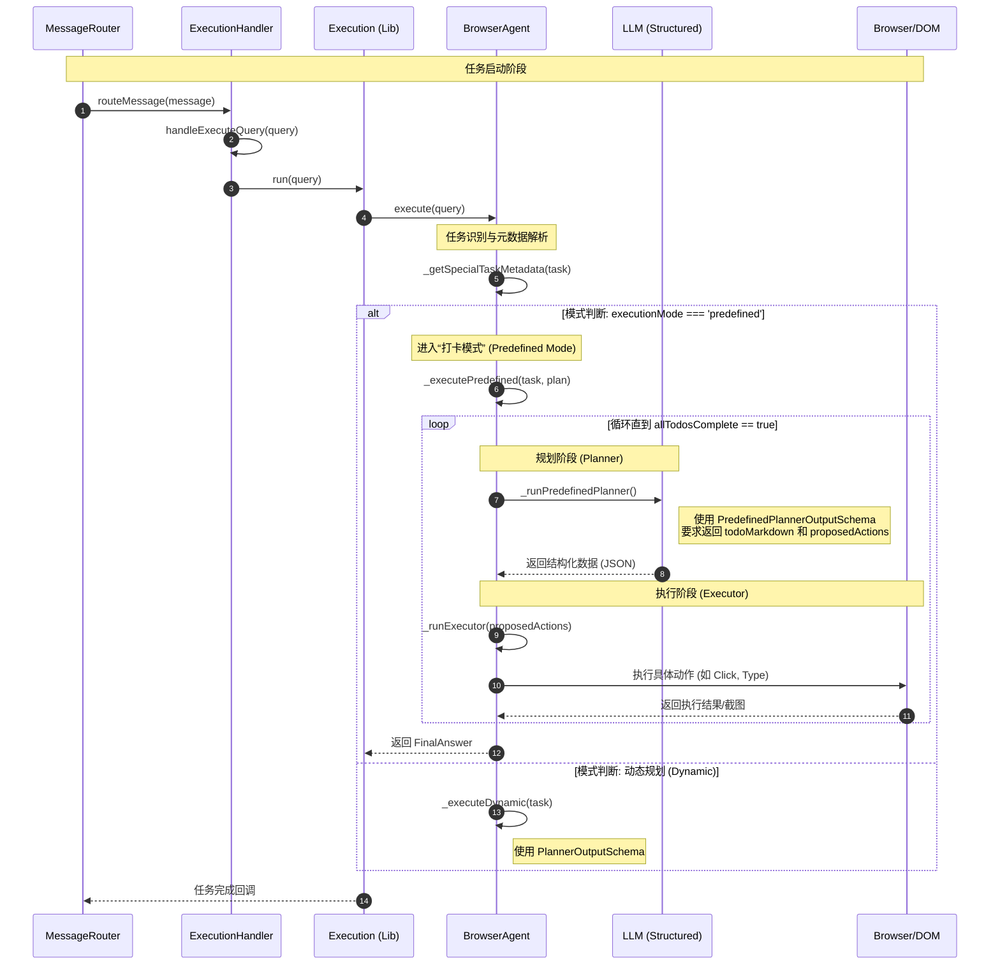

# 技术路线

预定义任务为任务的执行指明了roadmap。

PlannerOutputSchema 和 PredefinedPlannerOutputSchema 这两个 **Schema** 是用 **Zod** 库定义的“**数据结构契约**”。

它们的作用是：**强制要求 AI 模型必须按照指定的格式返回 JSON 数据。** AI 不能随便聊天，它必须像填表格一样，把每个字段都填好。

我们可以把它们看作是发给 AI 的**“标准化报告模板”**。

---

### 1. PlannerOutputSchema（动态规划模板）
这是给**动态规划（自由发挥模式）**使用的。它关注的是 AI 的**主观推理过程**。

**它的核心字段如下：**
*   **`userTask`**: 要求 AI 用自己的话复述任务（确保 AI 没理解错）。
*   **`executionHistory`**: 简述之前尝试了什么。
*   **`currentState`**: 描述 AI 当前看到的网页长什么样。
*   **`challengesIdentified`**: 记录遇到的困难（如：按钮点不动、报错等）。
*   **`stepByStepReasoning`**: **最重要的部分**。要求 AI 写下它的思考逻辑：“因为 A，所以我打算做 B”。
*   **`proposedActions`**: 这是一个数组（最多 5 个动作），给执行器的具体指令。
*   **`taskComplete`**: 布尔值（任务完了吗？）。
*   **`finalAnswer`**: 如果完了，请给出最终结果。

---

### 2. PredefinedPlannerOutputSchema（预定义规划模板）
这是给**预置任务（打卡模式）**使用的。它比上面多了一个极其关键的**“进度追踪器”**。

**它与上面的区别在于：**
*   **`todoMarkdown`（新增）**: 这是一个 Markdown 格式的清单（例如：`- [x] 步骤一 \n - [ ] 步骤二`）。AI 必须每一轮都更新这个清单。
*   **`allTodosComplete`（替代）**: 专门检查清单里的项是不是都打勾了。
*   **`finalAnswer`**: 只有当所有 TODO 都打勾时，才能填写此项。

---

### 3. 为什么需要这两个 Schema？

#### A. 解决 AI 的“幻觉”和“乱说话”
如果没有 Schema，AI 可能会返回：“好的，我正在为您处理，我现在打算去点那个按钮。”
有了 Schema，AI 必须返回：
```json
{
  "stepByStepReasoning": "我看到登录按钮了...",
  "proposedActions": ["Click on element 15"],
  "taskComplete": false
}
```
这样程序才能通过代码解析这些数据。

#### B. 自动生成 TypeScript 类型
代码中有一行：
`type PlannerOutput = z.infer<typeof PlannerOutputSchema>;`
这行代码能自动把这个 Schema 变成程序员写代码时用的“类型”。这样当你在代码里写 `plan.proposedActions` 时，编辑器会自动提示，且不会写错单词。

#### C. 数据验证
当 AI 返回数据时，Zod 会自动检查：
*   `proposedActions` 是不是数组？
*   数组长度有没有超过 5 个？
*   `taskComplete` 是不是布尔值？
如果 AI 乱填，程序会立刻报错并重试（`invokeWithRetry`），而不会导致程序崩溃。

---

### 形象的比喻

*   **`PlannerOutputSchema`** 就像是给**私家侦探**的报告单：
    > “你看到了什么？你遇到了什么困难？你下一步打算调查哪里？”

*   **`PredefinedPlannerOutputSchema`** 就像是给**工厂员工**的工单：
    > “工单上的 5 个步骤，哪几个打勾了？现在正在做第几个？做完之后请签字。”

**这就是 AI Agent 能够稳定运行的基石：用严格的数据结构来规范 AI 的思考。**

# 序列图


# 代码调用

```typescript
webpack://Agent/src/background/router/MessageRouter.ts
    routeMessage()
        handler(message)  // 调用 webpack://Agent/src/background/handlers/ExecutionHandler.ts/handleExecuteQuery()

webpack://Agent/src/background/handlers/ExecutionHandler.ts
    handleExecuteQuery()
        this.execution.run(query)  // 调用 webpack://Agent/src/lib/execution/Execution.ts/run()

webpack://Agent/src/lib/execution/Execution.ts
    run()
        Logging.logMetric()
        browseAgent.execute(query)  // 调用webpack://Agent/src/lib/agent/BrowserAgent.ts/execute()

webpack://Agent/src/lib/agent/BrowserAgent.ts
    execute()
        specialTaskMetadata = this._getSpecialTaskMetadata(task);
        /* type(specialTaskMetadata): json
        {
            "task": "Support BrowserOS on GitHub",
            "metadata": {
                "executionMode": "predefined",
                "predefinedPlan": {
                    "agentId": "github-star-browseros",
                    "name": "GitHub Repository Star",
                    "goal": "Navigate to BrowserOS GitHub repo and star it",
                    "steps": [
                        "Navigate to https://git.new/browserOS",
                        "Check if the star button indicates already starred (filled star icon)",
                        "If not starred (outline star icon), click the star button to star the repository",
                        "Use celebration_tool to show confetti animation"
                    ]
                }
            }
        }
        */
	    if (_metadata?.executionMode === 'predefined' && _metadata.predefinedPlan)
		    this._executePredefined(_task, _metadata.predefinedPlan)  // 调用 webpack://Agent/src/lib/agent/BrowserAgent.ts/_executePredefined()
		else
	        _executeDynamic(_task)
	        
webpack://Agent/src/lib/agent/BrowserAgent.ts
	_executePredefined()
		while (!allComplete)
	        planResult = this._runPredefinedPlanner()  // 调用 webpack://Agent/src/lib/agent/BrowserAgent.ts/_runPredefinedPlanner()
	        plan = planResult.output
	        executorResult = this._runExecutor(plan.proposedActions, plan)

webpack://Agent/src/lib/agent/BrowserAgent.ts
    _runPredefinedPlanner()
        structuredLLM = await getStructuredLLM(PredefinedPlannerOutputSchema)
