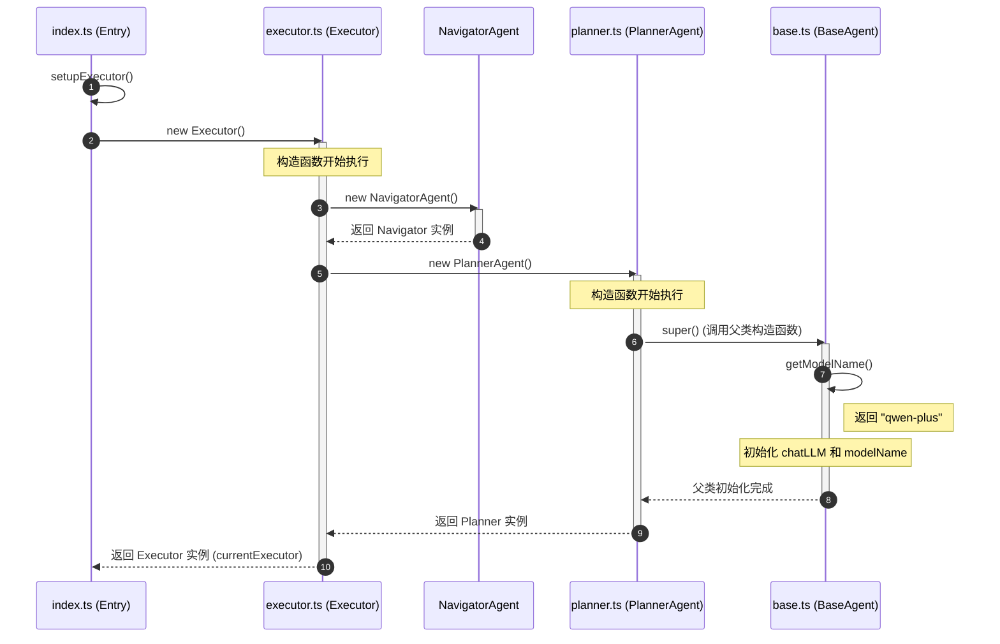

```typescript
index.ts
    currentExecutor = setupExecutor()  // 调用 index.js/setupExecutor()

index.ts
    setupExecutor()
        executor = new Executor()  // 调用 executor.ts/Executor/constructor()

executor.ts
    class Executor
        constructor()
            this.navigator = new NavigatorAgent()
            this.planner = new PlannerAgent()  // 调用 planner.ts/PlannerAgent/constructor

planner.ts
    class PlannerAgent extends BaseAgent
        constructor()
            super()  // 调用 base.ts/BaseAgent/constructor()

base.ts
    class BaseAgent
        constructor()
            this.chatLLM = options.chatLLM
            this.modelName = this.getModelName()  // "qwen-plus"
```