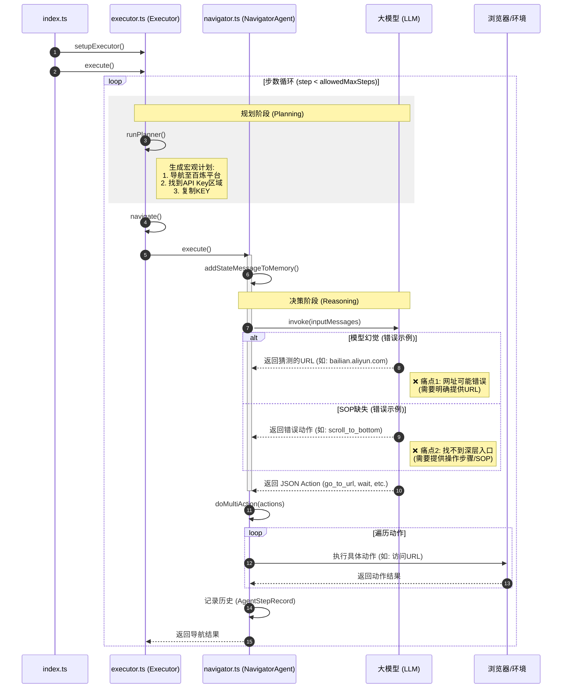

```typescript
index.ts
    currentExecutor = setupExecutor()
    result = currentExecutor.execute()  // 调用 executor.ts/Executor/execute()

executor.ts
    class Executor
        execute()
            for (step = 0; step < allowedMaxSteps; step++)
                if (context.nSteps % context.options.planningInterval === 0)
                    latestPlanOutput = this.runPlanner()
                    /* latestPlanOutput.result.next_steps: string
                    - Navigate to the platform where the百炼API KEY is located
                    - Locate the API KEY section or settings
                    - Copy the API KEY to the clipboard
                    */
                    /* latestPlanOutput.result.observation: string
                    "The task requires copying a百炼API KEY, which likely refers to an API key from a platform called '百炼'. The current browser state is at the start, so navigation to the appropriate platform is needed."
                    */
                navigatorDone = this.navigate()  // 调用 executor.ts/Executor/navigate()

executor.ts
    class Executor
        navigate()
            navOutput = this.navigator.execute()  // 调用 navigator.ts/NavigatorAgent/execute()

navigator.ts
    class NavigatorAgent
        execute()
            this.addStateMessageToMemory()
            modelOutput = this.invoke(inputMessages)
            /*modelOutput: json
            {
                "action": [
                    {
                        "go_to_url": {
                            "intent": "Navigate to the platform where the 百炼 API KEY is located",
                            "url": "https://console.bailian.aliyun.com/"
                        }
                    },
                    {
                        "wait": {
                            "seconds": 5
                        }
                    }
                ],
                "current_state": {
                    "evaluation_previous_goal": "Unknown - The browser has just started and no actions have been taken yet. The current page is empty.",
                    "memory": "Starting the task to copy the 百炼 API KEY. Need to navigate to the Bailian (百炼) console at https://console.bailian.aliyun.com/. This is the first step in locating the API key. 0 out of 1 websites to analyze. After navigation, need to check for login requirements and then locate the API key section.",
                    "next_goal": "Navigate to https://console.bailian.aliyun.com/ to access the 百炼 platform and find the API KEY."
                }
            }
            */
            /*
            说明：NavigatorAgent犯了错误。百炼控制台链接是什么？大模型不知道。（gemini 3.5 flash可以回答正确。gemini 2.0 flash-lite回答错误。如果是更加冷门的网址呢？所以不能假设大模型知道网址。通过明确向大模型提供网址可解决这个问题）
            */
            actionResults = await this.doMultiAction(actions)  // 调用 navigator.ts/NavigatorAgent/doMultiAction()
            history = new AgentStepRecord(modelOutputString, actionResultsCopy, browserStateHistory)
            this.context.history.history.push(history)

navigator.ts
    NavigatorAgent
        doMultiAction()
            for (const [i, action] of actions.entries())
                actionName = Object.keys(action)[0]  // "scroll_to_bottom"
                /*
                说明：NavigatorAgent犯了错误。进入百炼控制台后，如何获取api key? agent认为向下滚动页面能找到。通过这种方法肯定找不到。因为api key藏得很深，就算是人，也未必能找到。通过明确告诉大模型这方面的经验可以解决这个问题：
                1. 进入百炼控制台：bailian.console.aliyun.com
                2. 点击模型服务
                3. 点击秘钥管理
                3. 复制百炼API KEY
                成功完成任务。
                结论：必须明确告诉大模型怎么操作。
                */
```

