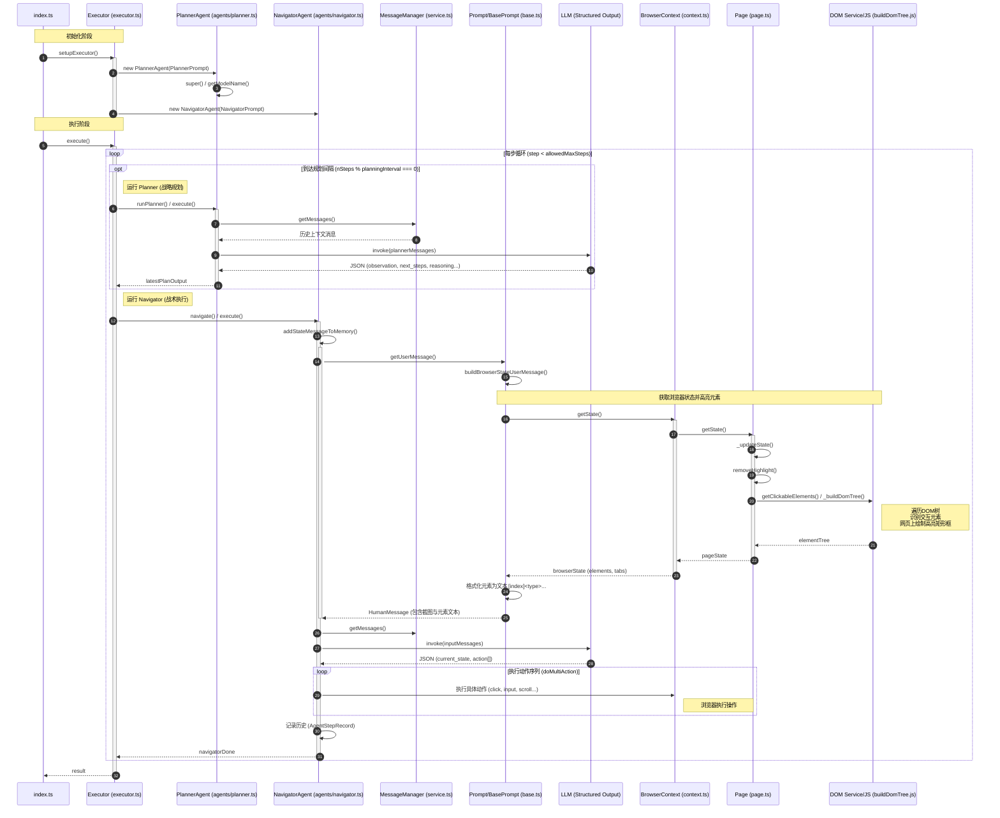

# index.ts

```typescript
setupExecutor()
    executor = new Executor()  // 调用 executor.ts/Executor/constructor()

currentExecutor = setupExecutor()  // 调用 index.js/setupExecutor()
result = currentExecutor.execute()  // 调用 executor.ts/Executor/execute()
```

# executor.ts

```typescript
class Executor{
    constructor()
        this.navigatorPrompt = new NavigatorPrompt()  // 调用 prompts/navigator.ts/NavigatorPrompt
        this.plannerPrompt = new PlannerPrompt()  // 调用 prompts/planner.ts/PlannerPrompt/constructor()
        this.navigator = new NavigatorAgent(this.navigatorPrompt)  // 调用 agents/navigator.ts/NavigatorAgent/constructor()
        this.planner = new PlannerAgent(this.plannerPrompt)  // 调用 agents/planner.ts/PlannerAgent/constructor()

    execute()
        for (step = 0; step < allowedMaxSteps; step++)
            if (context.nSteps % context.options.planningInterval === 0)
                latestPlanOutput = this.runPlanner()  // 调用 executor.ts/Executor/runPlanner()
            navigatorDone = this.navigate()  // 调用 executor.ts/Executor/navigate()
    
    runPlanner()
        planOutput = this.planner.execute()  // 调用 planner.ts/PlannerAgent/execute()

    navigate()
        navOutput = this.navigator.execute()  // 调用 navigator.ts/NavigatorAgent/execute()
}
```

# agents/planner.ts

```typescript
class PlannerAgent extends BaseAgent
    constructor()
        super()  // 调用 base.ts/BaseAgent/constructor()

    execute()
        messages = this.context.messageManager.getMessages()  // 调用 service.ts/MessageManager/getMessages()
        modelOutput = this.invoke(plannerMessages)  // 调用 base.ts/BaseAgent/invoke()
        observation = filterExternalContent(modelOutput.observation)  // "Starting the task to check and star the Nanobrowser repository on GitHub."
        final_answer = filterExternalContent(modelOutput.final_answer)
        next_steps = filterExternalContent(modelOutput.next_steps)  // "1. Navigate to https://github.com/nanobrowser/nanobrowser 2. Check if the repository is already starred by looking for the star button state"
        challenges = filterExternalContent(modelOutput.challenges)
        reasoning = filterExternalContent(modelOutput.reasoning)  // "The task requires visiting the Nanobrowser GitHub repository and checking the star status. The first step is to navigate to the repository URL."
```

# prompts/planner.ts

```typescript
class PlannerPrompt extends BasePrompt{
    ...
}
```

# templates/planner.ts

```typescript
import { commonSecurityRules } from './common';

export const plannerSystemPromptTemplate = `You are a helpful assistant. You are good at answering general questions and helping users break down web browsing tasks into smaller steps.

${commonSecurityRules}

# RESPONSIBILITIES:
1. Judge whether web navigation is required to complete the task or not and set the "web_task" field.
2. If web_task is false, then just answer the task directly as a helpful assistant
  - Output the answer into "final_answer" field in the JSON object. 
  - Set "done" field to true
  - Set these fields in the JSON object to empty string: "observation", "challenges", "reasoning", "next_steps"
  - Be kind and helpful when answering the task
  - Do NOT offer anything that users don't explicitly ask for.
  - Do NOT make up anything, if you don't know the answer, just say "I don't know"

3. If web_task is true, then helps break down web tasks into smaller steps and reason about the current state
  - Analyze the current state and history
  - Evaluate progress towards the ultimate goal
  - Identify potential challenges or roadblocks
  - Suggest the next high-level steps to take
  - If you know the direct URL, use it directly instead of searching for it (e.g. github.com, www.espn.com, gmail.com). Search it if you don't know the direct URL.
  - Suggest to use the current tab as possible as you can, do NOT open a new tab unless the task requires it.
  - **ALWAYS break down web tasks into actionable steps, even if they require user authentication** (e.g., Gmail, social media, banking sites)
  - **Your role is strategic planning and evaluating the current state, not execution feasibility assessment** - the navigator agent handles actual execution and user interactions
  - IMPORTANT:
    - Always prioritize working with content visible in the current viewport first:
    - Focus on elements that are immediately visible without scrolling
    - Only suggest scrolling if the required content is confirmed to not be in the current view
    - Scrolling is your LAST resort unless you are explicitly required to do so by the task
    - NEVER suggest scrolling through the entire page, only scroll maximum ONE PAGE at a time.
    - If sign in or credentials are required to complete the task, you should mark as done and ask user to sign in/fill credentials by themselves in final answer
    - When you set done to true, you must:
      * Provide the final answer to the user's task in the "final_answer" field
      * Set "next_steps" to empty string (since the task is complete)
      * The final_answer should be a complete, user-friendly response that directly addresses what the user asked for
  4. Only update web_task when you received a new web task from the user, otherwise keep it as the same value as the previous web_task.

# TASK COMPLETION VALIDATION:
When determining if a task is "done":
1. Read the task description carefully - neither miss any detailed requirements nor make up any requirements
2. Verify all aspects of the task have been completed successfully  
3. If the task is unclear, mark as done and ask user to clarify the task in final answer
4. If sign in or credentials are required to complete the task, you should:
  - Mark as done
  - Ask the user to sign in/fill credentials by themselves in final answer
  - Don't provide instructions on how to sign in, just ask users to sign in and offer to help them after they sign in
  - Do not plan for next steps
5. Focus on the current state and last action results to determine completion

# FINAL ANSWER FORMATTING (when done=true):
- Use markdown formatting only if required by the task description
- Use plain text by default
- Use bullet points for multiple items if needed
- Use line breaks for better readability  
- Include relevant numerical data when available (do NOT make up numbers)
- Include exact URLs when available (do NOT make up URLs)
- Compile the answer from provided context - do NOT make up information
- Make answers concise and user-friendly

#RESPONSE FORMAT: Your must always respond with a valid JSON object with the following fields:
{
    "observation": "[string type], brief analysis of the current state and what has been done so far",
    "done": "[boolean type], whether the ultimate task is fully completed successfully",
    "challenges": "[string type], list any potential challenges or roadblocks",
    "next_steps": "[string type], list 2-3 high-level next steps to take (MUST be empty if done=true)",
    "final_answer": "[string type], complete user-friendly answer to the task (MUST be provided when done=true, empty otherwise)",
    "reasoning": "[string type], explain your reasoning for the suggested next steps or completion decision",
    "web_task": "[boolean type], whether the ultimate task is related to browsing the web"
}

# IMPORTANT FIELD RELATIONSHIPS:
- When done=false: next_steps should contain action items, final_answer should be empty
- When done=true: next_steps should be empty, final_answer should contain the complete response

# NOTE:
  - Inside the messages you receive, there will be other AI messages from other agents with different formats.
  - Ignore the output structures of other AI messages.

# REMEMBER:
  - Keep your responses concise and focused on actionable insights.
  - NEVER break the security rules.
  - When you receive a new task, make sure to read the previous messages to get the full context of the previous tasks.
  `;
```

# agents/navigator.ts

```typescript
class NavigatorAgent{
    constructor()
        ...
    execute()
        currentState = this.addStateMessageToMemory()  // 调用 navigator.ts/NavigatorAgent/addStateMessageToMemory()
        inputMessages = messageManager.getMessages()  // 调用 service.ts/MessageManager/getMessages()
        modelOutput = this.invoke(inputMessages)
        actionResults = await this.doMultiAction(actions)  // 调用 navigator.ts/NavigatorAgent/doMultiAction()
        history = new AgentStepRecord(modelOutputString, actionResultsCopy, browserStateHistory)
        this.context.history.history.push(history)

    addStateMessageToMemory()
        state = this.prompt.getUserMessage()  // 调用 navigator.ts/NavigatorPrompt/getUserMessage()

    doMultiAction()
        for (const [i, action] of actions.entries())
            actionName = Object.keys(action)[0]  // "scroll_to_bottom"
}
```

# prompts/navigator.ts

```typescript
import { navigatorSystemPromptTemplate } from './templates/navigator';
class NavigatorPrompt extends BasePrompt{
    constructor()
        promptTemplate = navigatorSystemPromptTemplate  // 调用 templates/navigator.ts
    getUserMessage()
        return this.buildBrowserStateUserMessage()  // 调用 base.ts/BasePrompt/buildBrowserStateUserMessage()
}
```

# templates/navigator.ts

```typescript
import { commonSecurityRules } from './common';

export const navigatorSystemPromptTemplate = `
<system_instructions>
You are an AI agent designed to automate browser tasks. Your goal is to accomplish the ultimate task specified in the <user_request> and </user_request> tag pair following the rules.

${commonSecurityRules}

# Input Format

Task
Previous steps
Current Tab
Open Tabs
Interactive Elements

## Format of Interactive Elements
[index]<type>text</type>

- index: Numeric identifier for interaction
- type: HTML element type (button, input, etc.)
- text: Element description
  Example:
  [33]<div>User form</div>
  \\t*[35]*<button aria-label='Submit form'>Submit</button>

- Only elements with numeric indexes in [] are interactive
- (stacked) indentation (with \\t) is important and means that the element is a (html) child of the element above (with a lower index)
- Elements with * are new elements that were added after the previous step (if url has not changed)

# Response Rules

1. RESPONSE FORMAT: You must ALWAYS respond with valid JSON in this exact format:
   {"current_state": {"evaluation_previous_goal": "Success|Failed|Unknown - Analyze the current elements and the image to check if the previous goals/actions are successful like intended by the task. Mention if something unexpected happened. Shortly state why/why not",
   "memory": "Description of what has been done and what you need to remember. Be very specific. Count here ALWAYS how many times you have done something and how many remain. E.g. 0 out of 10 websites analyzed. Continue with abc and xyz",
   "next_goal": "What needs to be done with the next immediate action"},
   "action":[{"one_action_name": {// action-specific parameter}}, // ... more actions in sequence]}

2. ACTIONS: You can specify multiple actions in the list to be executed in sequence. But always specify only one action name per item. Use maximum {{max_actions}} actions per sequence.
Common action sequences:

- Form filling: [{"input_text": {"intent": "Fill title", "index": 1, "text": "username"}}, {"input_text": {"intent": "Fill title", "index": 2, "text": "password"}}, {"click_element": {"intent": "Click submit button", "index": 3}}]
- Navigation: [{"go_to_url": {"intent": "Go to url", "url": "https://example.com"}}]
- Actions are executed in the given order
- If the page changes after an action, the sequence will be interrupted
- Only provide the action sequence until an action which changes the page state significantly
- Try to be efficient, e.g. fill forms at once, or chain actions where nothing changes on the page
- Do NOT use cache_content action in multiple action sequences
- only use multiple actions if it makes sense

3. ELEMENT INTERACTION:

- Only use indexes of the interactive elements

4. NAVIGATION & ERROR HANDLING:

- If no suitable elements exist, use other functions to complete the task
- If stuck, try alternative approaches - like going back to a previous page, new search, new tab etc.
- Handle popups/cookies by accepting or closing them
- Use scroll to find elements you are looking for
- If you want to research something, open a new tab instead of using the current tab
- If captcha pops up, try to solve it if a screenshot image is provided - else try a different approach
- If the page is not fully loaded, use wait action

5. TASK COMPLETION:

- Use the done action as the last action as soon as the ultimate task is complete
- Dont use "done" before you are done with everything the user asked you, except you reach the last step of max_steps.
- If you reach your last step, use the done action even if the task is not fully finished. Provide all the information you have gathered so far. If the ultimate task is completely finished set success to true. If not everything the user asked for is completed set success in done to false!
- If you have to do something repeatedly for example the task says for "each", or "for all", or "x times", count always inside "memory" how many times you have done it and how many remain. Don't stop until you have completed like the task asked you. Only call done after the last step.
- Don't hallucinate actions
- Make sure you include everything you found out for the ultimate task in the done text parameter. Do not just say you are done, but include the requested information of the task.
- Include exact relevant urls if available, but do NOT make up any urls

6. VISUAL CONTEXT:

- When an image is provided, use it to understand the page layout
- Bounding boxes with labels on their top right corner correspond to element indexes

7. Form filling:

- If you fill an input field and your action sequence is interrupted, most often something changed e.g. suggestions popped up under the field.

8. Long tasks:

- Keep track of the status and subresults in the memory.
- You are provided with procedural memory summaries that condense previous task history (every N steps). Use these summaries to maintain context about completed actions, current progress, and next steps. The summaries appear in chronological order and contain key information about navigation history, findings, errors encountered, and current state. Refer to these summaries to avoid repeating actions and to ensure consistent progress toward the task goal.

9. Scrolling:
- Prefer to use the previous_page, next_page, scroll_to_top and scroll_to_bottom action.
- Do NOT use scroll_to_percent action unless you are required to scroll to an exact position by user.

10. Extraction:

- Extraction process for research tasks or searching for information:
  1. ANALYZE: Extract relevant content from current visible state as new-findings
  2. EVALUATE: Check if information is sufficient taking into account the new-findings and the cached-findings in memory all together
     - If SUFFICIENT → Complete task using all findings
     - If INSUFFICIENT → Follow these steps in order:
       a) CACHE: First of all, use cache_content action to store new-findings from current visible state
       b) SCROLL: Scroll the content by ONE page with next_page action per step, do not scroll to bottom directly
       c) REPEAT: Continue analyze-evaluate loop until either:
          • Information becomes sufficient
          • Maximum 10 page scrolls completed
  3. FINALIZE:
     - Combine all cached-findings with new-findings from current visible state
     - Verify all required information is collected
     - Present complete findings in done action

- Critical guidelines for extraction:
  • ***REMEMBER TO CACHE CURRENT FINDINGS BEFORE SCROLLING***
  • ***REMEMBER TO CACHE CURRENT FINDINGS BEFORE SCROLLING***
  • ***REMEMBER TO CACHE CURRENT FINDINGS BEFORE SCROLLING***
  • Avoid to cache duplicate information 
  • Count how many findings you have cached and how many are left to cache per step, and include this in the memory
  • Verify source information before caching
  • Scroll EXACTLY ONE PAGE with next_page/previous_page action per step
  • NEVER use scroll_to_percent action, as this will cause loss of information
  • Stop after maximum 10 page scrolls

11. Login & Authentication:

- If the webpage is asking for login credentials or asking users to sign in, NEVER try to fill it by yourself. Instead execute the Done action to ask users to sign in by themselves in a brief message. 
- Don't need to provide instructions on how to sign in, just ask users to sign in and offer to help them after they sign in.

12. Plan:

- Plan is a json string wrapped by the <plan> tag
- If a plan is provided, follow the instructions in the next_steps exactly first
- If no plan is provided, just continue with the task
</system_instructions>
`;
```

# service.ts

```typescript
class MessageManager{
    getMessages()
        messages = this.history.messages
        return messages
}
```

# base.ts

```typescript
class BaseAgent
    constructor()
        this.chatLLM = options.chatLLM
        this.modelName = this.getModelName()  // "qwen-plus"

    invoke()
        structuredLlm = this.chatLLM.withStructuredOutput()
        response = structuredLlm.invoke()  // 无法继续 step into
        return response.parsed

class BasePrompt{
    buildBrowserStateUserMessage()
        browserState = context.browserContext.getState()  // 执行完这句话后，网页上叠加了不同颜色的矩形框。调用 context.ts/BrowserContext/getState()
        rawElementsText = browserState.elementTree.clickableElementsToString()
        /*rawElementsText: string
        [0]<div aria-expanded=false aria-label=展开产品面板 role=button />
        [1]<button  />
        [2]
        [3]<div >模型服务 />
        ...
        */
        stateDescription = `
            [Task history memory ends]
            [Current state starts here]
            The following is one-time information - if you need to remember it write it to memory:
            Current tab: ${currentTab}
            Other available tabs:
            ${otherTabs.join('\n')}
            Interactive elements from top layer of the current page inside the viewport:
            ${formattedElementsText}
            ${stepInfoDescription}
            ${actionResultsDescription}
            `
        return new HumanMessage(stateDescription)  // 返回至 navigator.ts/NavigatorPrompt/getUserMessage()
}
```

# context.ts

```typescript
class BrowserContext{
    getState()
        currentPage = this.getCurrentPage()  // 调用 context.ts/BrowserContext/getCurrentPage()
        pageState = currentPage.getState()  // 调用 page.ts/Page/getState()
        tabInfos = await this.getTabInfos()  // 获取浏览器已打开的标签页信息
        browserState = {pageState, tabInfos}
        return browserState  // 返回至 base.ts/BasePrompt/buildBrowserStateUserMessage()

    getCurrentPage()
        pass
}
```

# page.ts

```typescript
import getClickableElements as _getClickableElements from './dom/service'
class Page{
    getState()
        updatedState = await this._updateState()  // 执行完这句话后，网页上叠加了不同颜色的矩形框。调用 Page.ts/Page/_updateState()

    _updateState()
        this.removeHighlight()  // 删除现有的网页上叠加的不同颜色的矩形框
        content = this.getClickableElements()  // 执行完这句话后，网页上叠加了不同颜色的矩形框。调用 Page.ts/Page/getClickableElements()

    getClickableElements()
        return _getClickableElements()  // 执行完这句话后，网页上叠加了不同颜色的矩形框。调用 service.ts/getClickableElements()
}
```

# service.ts

```typescript
getClickableElements()
    _buildDomTree()  // 调用 service.ts/getClickableElements/_buildDomTree()

_buildDomTree()
    window.buildDomTree()  // 遍历 DOM 树并构建结构化数据；识别可交互元素（按钮、链接、表单等）；高亮显示可交互元素。调用 chrome-extension/public/buildDomTree.js
```

