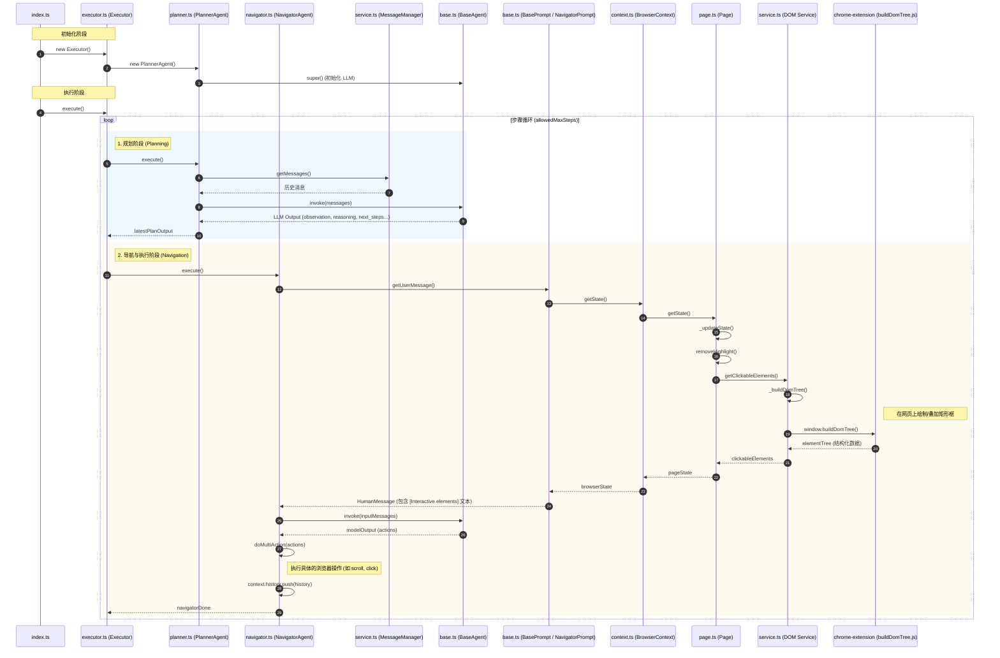

# index.ts

```typescript
setupExecutor()
    executor = new Executor()  // 调用 executor.ts/Executor/constructor()

currentExecutor = setupExecutor()  // 调用 index.js/setupExecutor()
result = currentExecutor.execute()  // 调用 executor.ts/Executor/execute()
```

# executor.ts

```typescript
class Executor
    constructor()
        this.navigator = new NavigatorAgent()
        this.planner = new PlannerAgent()  // 调用 planner.ts/PlannerAgent/constructor

    execute()
        for (step = 0; step < allowedMaxSteps; step++)
            if (context.nSteps % context.options.planningInterval === 0)
                latestPlanOutput = this.runPlanner()  // 调用 executor.ts/Executor/runPlanner()
            navigatorDone = this.navigate()  // 调用 executor.ts/Executor/navigate()
    
    runPlanner()
        planOutput = this.planner.execute()  // 调用 planner.ts/PlannerAgent/execute()

    navigate()
        navOutput = this.navigator.execute()  // 调用 navigator.ts/NavigatorAgent/execute()
```

# planner.ts

```typescript
class PlannerAgent extends BaseAgent
    constructor()
        super()  // 调用 base.ts/BaseAgent/constructor()

    execute()
        messages = this.context.messageManager.getMessages()  // 调用 service.ts/MessageManager/getMessages()
        modelOutput = this.invoke(plannerMessages)  // 调用 base.ts/BaseAgent/invoke()
        observation = filterExternalContent(modelOutput.observation)  // "Starting the task to check and star the Nanobrowser repository on GitHub."
        final_answer = filterExternalContent(modelOutput.final_answer)
        next_steps = filterExternalContent(modelOutput.next_steps)  // "1. Navigate to https://github.com/nanobrowser/nanobrowser 2. Check if the repository is already starred by looking for the star button state"
        challenges = filterExternalContent(modelOutput.challenges)
        reasoning = filterExternalContent(modelOutput.reasoning)  // "The task requires visiting the Nanobrowser GitHub repository and checking the star status. The first step is to navigate to the repository URL."
```

# navigator.ts

```typescript
class NavigatorAgent
    execute()
        this.addStateMessageToMemory()  // 调用 navigator.ts/NavigatorAgent/addStateMessageToMemory()
        modelOutput = this.invoke(inputMessages)
        actionResults = await this.doMultiAction(actions)  // 调用 navigator.ts/NavigatorAgent/doMultiAction()
        history = new AgentStepRecord(modelOutputString, actionResultsCopy, browserStateHistory)
        this.context.history.history.push(history)

    addStateMessageToMemory()
        state = this.prompt.getUserMessage()  // 调用 navigator.ts/NavigatorPrompt/getUserMessage()

    doMultiAction()
        for (const [i, action] of actions.entries())
            actionName = Object.keys(action)[0]  // "scroll_to_bottom"

class NavigatorPrompt extends BasePrompt
    getUserMessage()
        this.buildBrowserStateUserMessage()  // 调用 base.ts/BasePrompt/buildBrowserStateUserMessage()
```

# service.ts

```typescript
class MessageManager
    getMessages()
        messages = this.history.messages
        return messages
```

# base.ts

```typescript
class BaseAgent
    constructor()
        this.chatLLM = options.chatLLM
        this.modelName = this.getModelName()  // "qwen-plus"

    invoke()
        structuredLlm = this.chatLLM.withStructuredOutput()
        response = structuredLlm.invoke()  // 无法继续 step into
        return response.parsed

class BasePrompt{
    buildBrowserStateUserMessage()
        browserState = context.browserContext.getState()  // 执行完这句话后，网页上叠加了不同颜色的矩形框。调用 context.ts/BrowserContext/getState()
        rawElementsText = browserState.elementTree.clickableElementsToString()
        /*rawElementsText: string
        [0]<div aria-expanded=false aria-label=展开产品面板 role=button />
        [1]<button  />
        [2]
        [3]<div >模型服务 />
        ...
        */
        stateDescription = `
            [Task history memory ends]
            [Current state starts here]
            The following is one-time information - if you need to remember it write it to memory:
            Current tab: ${currentTab}
            Other available tabs:
            ${otherTabs.join('\n')}
            Interactive elements from top layer of the current page inside the viewport:
            ${formattedElementsText}
            ${stepInfoDescription}
            ${actionResultsDescription}
            `
        return new HumanMessage(stateDescription)
}
```

# context.ts

```typescript
class BrowserContext{
    getState()
        currentPage = this.getCurrentPage()  // 调用 context.ts/BrowserContext/getCurrentPage()
        pageState = currentPage.getState()  // 调用 page.ts/Page/getState()

    getCurrentPage()
        pass
}
```

# page.ts

```typescript
import getClickableElements as _getClickableElements from './dom/service'
class Page{
    getState()
        updatedState = await this._updateState()  // 执行完这句话后，网页上叠加了不同颜色的矩形框。调用 Page.ts/Page/_updateState()

    _updateState()
        this.removeHighlight()  // 删除现有的网页上叠加的不同颜色的矩形框
        content = this.getClickableElements()  // 执行完这句话后，网页上叠加了不同颜色的矩形框。调用 Page.ts/Page/getClickableElements()

    getClickableElements()
        return _getClickableElements()  // 执行完这句话后，网页上叠加了不同颜色的矩形框。调用 service.ts/getClickableElements()
}
```

# service.ts

```typescript
getClickableElements()
    _buildDomTree()  // 调用 service.ts/getClickableElements/_buildDomTree()

_buildDomTree()
    window.buildDomTree()  // 遍历 DOM 树并构建结构化数据；识别可交互元素（按钮、链接、表单等）；高亮显示可交互元素。调用 chrome-extension/public/buildDomTree.js
```

