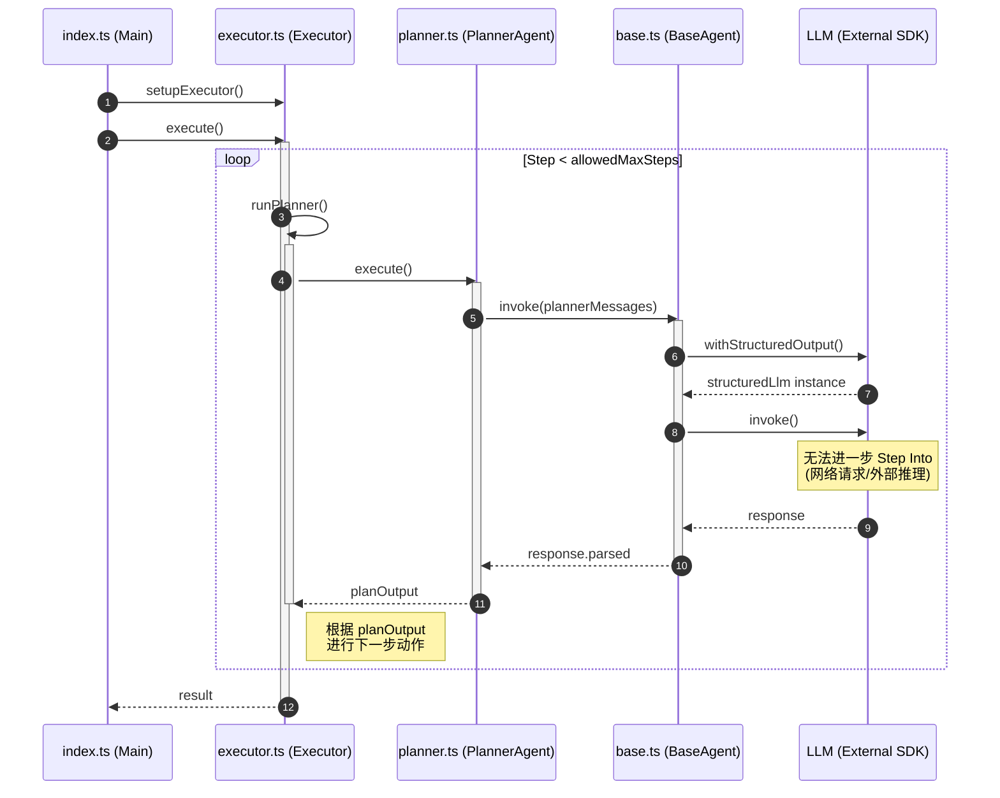

```typescript
index.ts
    currentExecutor = setupExecutor()
    result = currentExecutor.execute()  // 调用 executor.ts/Executor/execute()

executor.ts
    class Executor
        execute()
            for (step = 0; step < allowedMaxSteps; step++)
                latestPlanOutput = this.runPlanner()  // 调用 executor.ts/Executor/runPlanner()

executor.ts
    class Executor
        runPlanner()
            planOutput = this.planner.execute()  // 调用 planner.ts/PlannerAgent/execute()

planner.ts
    class PlannerAgent
        execute()
            modelOutput = this.invoke(plannerMessages)  // 调用 base.ts/BaseAgent/invoke()

base.ts
    class BaseAgent
        invoke()
            structuredLlm = this.chatLLM.withStructuredOutput()
            response = structuredLlm.invoke()  // 无法继续 step into
            return response.parsed
```