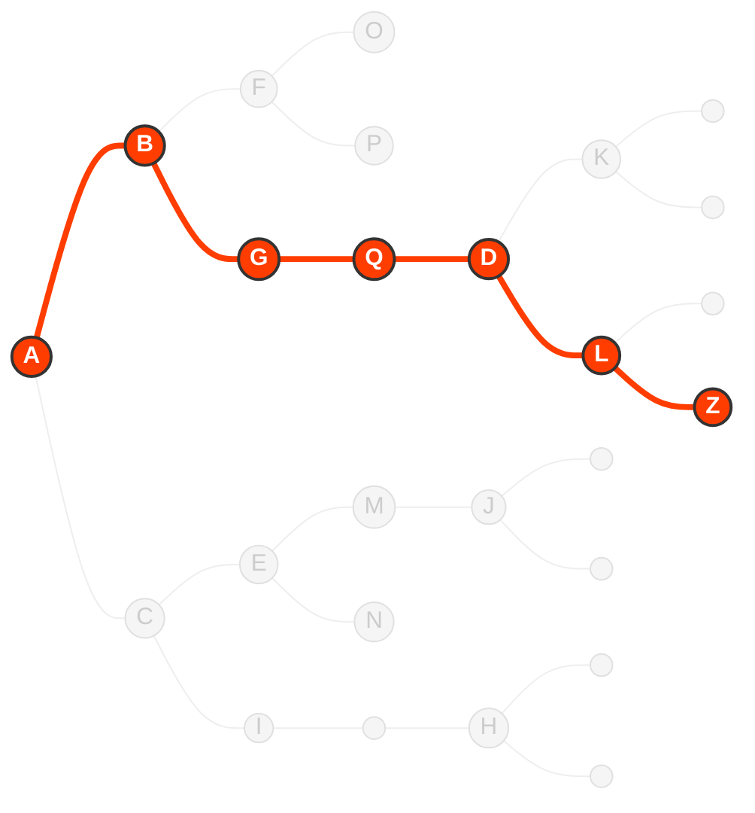

```mermaid
graph LR
    %% 定义样式
    classDef active fill:#FF3D00,stroke:#333,stroke-width:2px,color:#fff,font-weight:bold;
    classDef dim fill:#f5f5f5,stroke:#e0e0e0,color:#ccc;
    classDef smallCircle fill:#eee,stroke:#ddd,stroke-width:1px,width:12px,height:12px,r:6px;

    %% 节点定义
    A((A))
    B((B))
    C((C))
    D((D))
    E((E))
    F((F))
    G((G))
    H((H))
    I((I))
    J((J))
    K((K))
    L((L))
    M((M))
    N((N))
    O((O))
    P((P))
    Q((Q))
    R((" "))
    S((" "))
    T((" "))
    U((" "))
    V((" "))
    W((" "))
    X((" "))
    Y((" "))
    Z((Z))

    %% 连线关系 (注意顺序，用于 linkStyle 索引)
    A --- B
    A --- C
    C --- E
    B --- F
    B --- G
    C --- I
    D --- K
    D --- L
    E --- M
    E --- N
    F --- O
    F --- P
    G --- Q
    H --- R
    H --- S
    I --- T
    J --- U
    J --- V
    K --- W
    K --- X
    L --- Y
    L --- Z
    Q --- D
    M --- J
    T --- H

    %% 应用节点样式
    class A,B,G,Q,D,L,Z active
    class C,E,F,H,I,J,K,M,N,O,P,R,S,T,U,V,W,X,Y dim

    %% 应用连线样式 (默认全部淡化)
    linkStyle 0,1,2,3,4,5,6,7,8,9,10,11,12,13,14,15,16,17,18,19,20,21,22,23,24 stroke:#eee,stroke-width:1px;
    %% 高亮路径 A-B(0), B-G(4), G-Q(12), Q-D(22), D-L(7), L-Z(21)
    linkStyle 0,4,12,22,7,21 stroke:#FF3D00,stroke-width:4px;
```