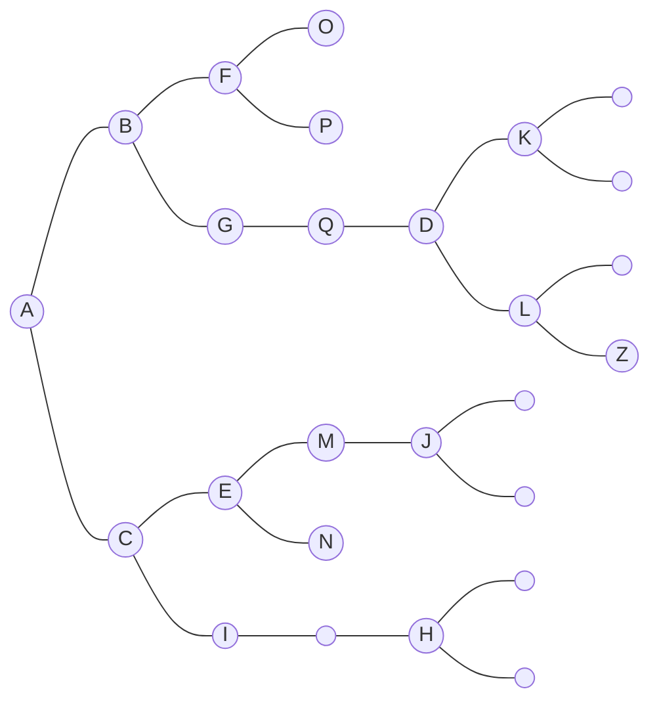

```mermaid
graph LR
    %% 定义节点样式 - 小小的圆
    classDef smallCircle fill:#333,stroke:#333,stroke-width:1px,width:12px,height:12px,r:6px;
    
    %% 第0层 - 根节点
    A((A))
    
    %% 第1层
    B((B))
    C((C))
    D((D))
    
    %% 第2层 - B的子节点
    E((E))
    F((F))
    G((G))
    
    %% 第2层 - C的子节点
    H((H))
    I((I))
    
    %% 第2层 - D的子节点
    J((J))
    K((K))
    L((L))
    
    %% 第3层 - E的子节点
    M((M))
    N((N))
    
    %% 第3层 - F的子节点
    O((O))
    P((P))
    
    %% 第3层 - G的子节点
    Q((Q))
    
    %% 第3层 - H的子节点
    R(( ))
    S(( ))
    
    %% 第3层 - I的子节点
    T(( ))
    
    %% 第3层 - J的子节点
    U(( ))
    V(( ))
    
    %% 第3层 - K的子节点
    W(( ))
    X(( ))
    
    %% 第3层 - L的子节点
    Y(( ))
    Z((Z))
    

    %% 连接关系
    A --- B
    A --- C
    
    C --- E
    B --- F
    B --- G
    
    C --- I
    
    D --- K
    D --- L
    
    E --- M
    E --- N
    
    F --- O
    F --- P
    
    G --- Q
    
    H --- R
    H --- S
    
    I --- T
    
    J --- U
    J --- V
    
    K --- W
    K --- X
    
    L --- Y
    L --- Z

    Q --- D

    M --- J

    T --- H
```