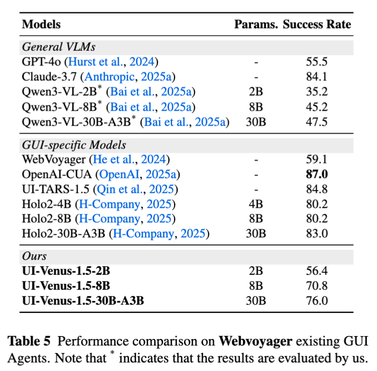
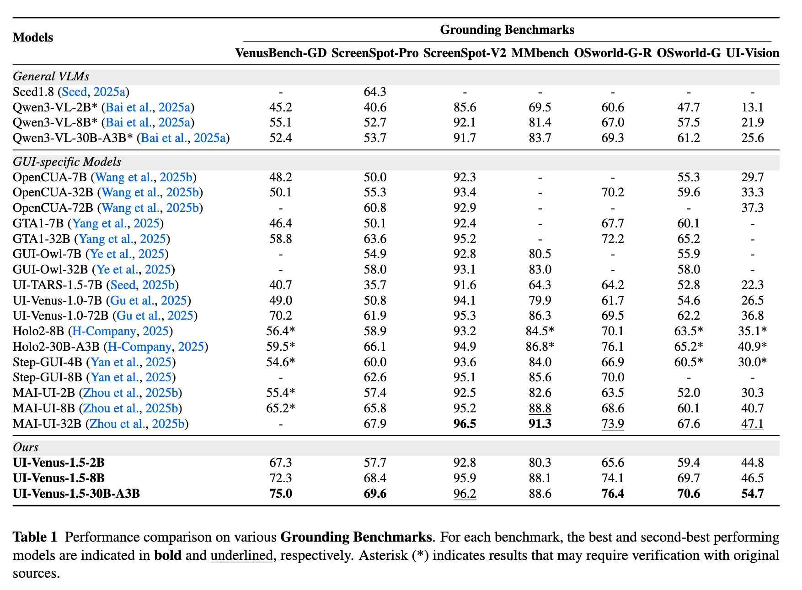
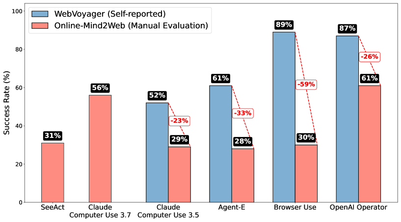

# 实验背景

节前最后一天，主任与我谈话，新工作方向就是原生GUI Agent。

为什么我之前的浏览器自动化脚本不行？不可复制。因此只有原生GUI Agent具有可复制性。

原生 GUI Agent 确实是学术界的主流。

# 实验目的

哪个原生GUI Agent能部署？

# 实验步骤

## UI-Venus-1.5

### 优点

- 很新，2026年2月份。
- 阿里出品，大厂有保障。

### 精度

#### Webvoyager



在 Webvoyager 上，不如 UI-TARS-1.5 好。
- UI-TARS-1.5: 84.8
- UI-Venus-1.5-30B-A3B: 76.0

#### Grounding



在 OSworld-G 上，远超 UI-TARS-1.5-7B
- UI-TARS-1.5-7B: 52.8
- UI-Venus-1.5-30B-A3B: 70.6

### 怎么运行网页自动化？

https://github.com/inclusionAI/UI-Venus/blob/UI-Venus-1.5/scripts/run_navi.sh

```bash
INPUT_FILE="examples/trace/trace.json"
python models/navigation/runner.py --input_file="${INPUT_FILE}"
```

https://github.com/inclusionAI/UI-Venus/blob/UI-Venus-1.5/examples/trace/trace.json

```json
[
    [
        {
            "image_path": "examples/trace/5842fa4411caad04cbcd67e514c2b426.png",
            "task": "在夸克浏览器中，查看云图片中的\"壁纸_3.jpg\"的详细信息，并记住文件名，文件大小和文件ID，并以空格分隔符分隔，输出"
        },
        {
            "image_path": "examples/trace/9795177942c1ed0bc654517934ceeb31.png",
            "task": "在夸克浏览器中，查看云图片中的\"壁纸_3.jpg\"的详细信息，并记住文件名，文件大小和文件ID，并以空格分隔符分隔，输出"
        }
    ]
]
```

https://github.com/inclusionAI/UI-Venus/blob/UI-Venus-1.5/models/navigation/runner.py

```python
data = read_json(args.input_file)
for trace_index, trace in enumerate(data):
    for item in trace:
        task = item['task']
        image_path = item['image_path']
        action_json = venus_agent.step(task, image_path)  # 执行一步操作
    history_record = venus_agent.export_history()
    venus_agent.reset()
    results.append(history_record)
```

### 结论

虽然有agent代码，但是缺乏了与真实环境交互的代码（代码只提供了与安卓真实环境交互的代码）。所以不可用。

## Online-Mind2Web

本文只是提出了一个benchmark，没有提出一个在该benchmark上效果很好的方法。



### WebVoyager

Browser Use: 89%

## Browser Use

提供了agent代码（包括与真实环境交互的代码），但是模型用的是通过大模型而非专门在GUI上训练的大模型。而且好像主要依赖的是DOM而非截图。

## Fara 7B

fara-cli --task "whats the weather in new york now"

提供了 agent 代码（包括与真实环境交互的代码），模型是专门在GUI上训练的大模型。该模型是基于视觉和键鼠的模型。

在 Webvoyager 上，性能超过了 UI-TARS-1.5-7B

## 接下来要做什么？

- 找到安装 Fara 7B 的机器
    - 找张旭。如何获得重视？我很重视。我为什么重视？主任重视。
        - 主任在节前找我谈了一次话，结论是 GUI Agent 还是要借助专用模型来实现。我现在想部署一个7B的GUI Agent专用模型，但是我不知道有哪台机器能部署。
- 基于 Fara 7B 制作汇报内容
    - 要让数据组知道怎么标注数据
    - 要让微调组知道怎么微调数据
    - 要向同事证明这是最好的方案
    - 要让同事知道和GLM的关系

## Fara7B 报告

原生CUA模型，它仅使用屏幕截图即可感知计算机，通过预测坐标执行操作。

### 任务定义

给定用户的初始自然语言查询 $q_0$，GUI Agent 会根据环境状态，以多步骤的方式逐一输出动作，直到输出停止动作为止。

一条轨迹中的单个步骤 $t$ 包含三部分：
- 来自网页环境的观测（$o_t$​）
- 对当前状态进行反思、并决定下一步该做什么的思考 / 思维链（$r_t$​）
- 要执行的下一个动作（$a_t$）

### 两种 GUI Agent

CUA领域的研究涵盖两大范式，二者在观察和行动空间的选择上有所不同。一类智能体使用结构化对象（例如DOM或可访问性树）来理解屏幕。这些抽象简化了操作选择和基础。然而，现实世界的网站通常包含不规则的标记、动态生成的内容、个性化设置和视觉效果丰富的布局，导致基准性能与实际部署之间持续存在差距。

为了更好地模拟人类计算机的使用方式，近期的研究采用了像素输入、动作输出的模式。

### 训练任务

#### 轨迹任务

将每条轨迹的每一步单独作为一个训练样本，把截至当前步骤的历史观测与动作作为模型输入。

我们采用 Qwen2.5-VL 的定位规范，并预测绝对坐标。我们使用标准的交叉熵损失，所有输出都是模型词表中的 token，包括坐标。

#### UI问答任务

一条训练数据包括三部分：
- 截图
- 问题
- 回答


问题：门票的配送日期是？

回答：2025 年 3 月 28 日

#### UI定位任务

一条训练数据包括三部分：
- 截图
- 问题
- 回答


问题：点击衣服的 XL 尺寸

回答：click(1189, 252)

### 训练细节

我们使用 Qwen2.5-VL-7B 作为基座模型，并在其基础上进行监督微调（SFT）。

我们使用标准的交叉熵损失，所有输出都是模型词表中的 token，包括坐标。

把每一步单独切成一条训练数据。

对于轨迹数据，我们将每条轨迹的每一步单独作为一个训练样本，把截至当前步骤的历史观测与动作作为模型输入。

- 优化器：AdamW，其参数设置为 $\beta_1 = 0.9, \beta_2 = 0.95$
- 学习率：在训练步数的前 10% 阶段采用余弦学习率预热策略；预热结束后，初始学习率设置为 $5\times 10^{-6}$
- 梯度裁剪：最大阈值设为 1
- 批次大小 = 128
- 参数精度：BF16

### 思考

感觉这篇论文能讲的就是这些。但是这肯定远远不够。怎么办？要扩充。如何扩充？

题目：GUI Agent 在公安业务流程自动化中的应用

完整的报告内容放在下一个实验（实验97）中。