# GUI Agent 在公安业务流程自动化中的应用

## 背景与需求

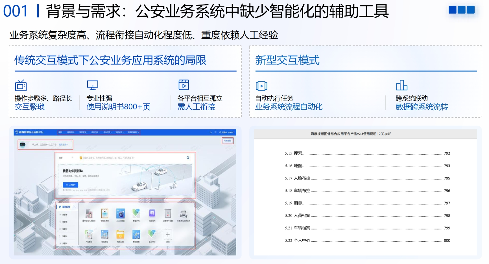
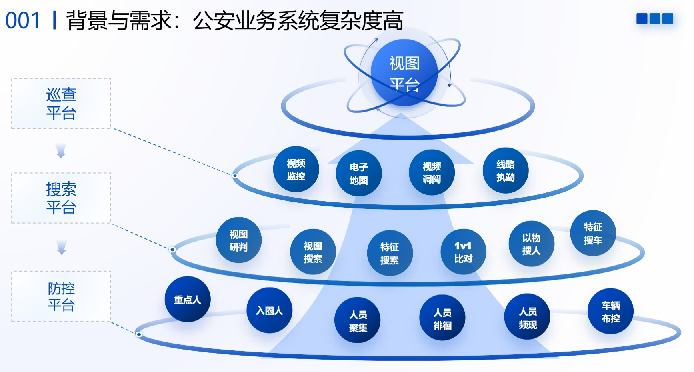

## 传统的流程自动化

### RPA

流程自动化的典型产品形态为 RPA (Robotic Process Automation)，通过模拟人类在计算机界面上的操作逻辑，在不改变企业现有 IT 架构的前提下，实现跨系统、跨平台的业务衔接，能够极大地提升数据流转的效率与精准度。

| 时间   | 里程碑         | 说明 |
| ------ | ------------ | -------- |
| 2005年 | UiPath       | UiPath公司成立。全球RPA行业领军企业，提供自动化平台。帮助企业处理重复性办公任务。市值70亿美元。 |
| 2012年 | RPA 术语提出 | Prism 公司正式提出RPA术语。该行业进入黄金期，大量金融企业使用RPA系统处理银行账单与表格。 |
| 2019年 | 国产 RPA     | 国产RPA产品影刀RPA诞生。广泛应用于电商行业，完成自动上架商品、批量抓取竞品价格等任务。 |

### 浏览器自动化

RPA软件的核心技术之一是浏览器自动化技术，用于模拟人类用户在Web环境下的交互行为，实现复杂业务流程的自动化处理。

| 时间   | 里程碑       | 说明 |
| ------ | ---------- | -------- |
| 2004年 | Selenium   | 成立于2004年，老牌Web自动化工具，目前网页自动化测试及任务处理领域最权威的全球行业标准。 |
| 2017年 | Puppeteer  | 2017年由谷歌推出。基于Chrome DevTools Protocol (CDP)，能够以极高的效率和稳定性控制 Chrome 浏览器。 |
| 2020年 | Playwright | 2020年，由微软发布，由原 Puppeteer 团队打造，支持跨浏览器的统一自动化，解决多窗口、异步加载等待等痛点。 |

## AI 时代的流程自动化

相比于传统的浏览器自动化，在AI时代，兴起了三类新的流程自动化方式：
- AI + RPA，即 IPA（Intelligent Process Automation，智能流程自动化）
- GUI Agent
    - 基于视觉感知的 GUI Agent
    - 基于 DOM 感知的 Web Agent

接下来依次介绍每种方式及其优缺点。

### AI + RPA

是 RPA 在 AI 时代的演进。以前RPA是针对每个任务都要写自动化脚本。但同一网站的不同任务之间往往有知识重叠，传统 RPA 无法复用这些共有的知识。

不是为每个任务构建自动化脚本，而是为整个网站构建语义地图——为网站中的每个关键元素定义AI可理解的含义及操作方式。当用户提出一个自动化任务时，AI能够根据语义地图自动生成自动化脚本并执行。具体来说，Web 应用 $A$ 的最小功能单元是 **Element（元素）**，记为 $e$。一个 Web 应用可以被定义为所有可见及可交互元素的集合：
$$A = \{e_1, e_2, e_3, \dots, e_n\}$$

每个元素 $e_i$ 并非孤立存在，而是由三个维度构成的复合体：

*   **元素标识（Identity - 感知层）：**
    *   **定义：** 机器定位元素的物理路径或特征（如 CSS 选择器、XPath、ID）。
    *   **示例：** `login_button = tab.ele('.form-cut-item-btn')`
    *   **作用：** 解决“它在哪里”的问题，实现机器对页面的**物理感知**。

*   **元素操作（Action - 行动层）：**
    *   **定义：** 对元素施加的状态改变或交互指令。
    *   **示例：** `login_button.click()`
    *   **作用：** 解决“如何交互”的问题，定义交互原语（Click/Input/Select），触发页面的**状态转换**。

*   **元素含义（Semantics - 语义层）：**
    *   **定义：** 描述该元素在业务逻辑中的角色、前置条件及行为后果。
    *   **示例：** “在用户输入凭据后点击此按钮，验证通过后将跳转至【应用市场页】。”
    *   **作用：** 解决“它是做什么的”的问题，赋予操作以**业务含义**。描述业务角色、前置依赖及跳转后果。

通过对 Web 应用中原子元素 $e_i$ 进行上述三要素的建模，便可构建出一张**网页语义地图**，每个元素成为地图上的一个具有业务意义的节点。

优点：生成的流程自动化脚本可人工确认（准确性能够保证）。

优点：速度有保证。一旦生成了自动化脚本，不用思考即可长期运行，不用每步都思考。

难点：如何为网页元素建模？如果靠人工，需要浏览器领域专业人员才能做到（正如只有RPA从业者才知道如何构建RPA脚本），即使想通过大模型进行构建，依然缺乏初始的专家知识。

却点：处理不了突发情况。系统稳定。

### GUI Agent

定义：泛指能够像人类一样通过视觉感知图形界面，并执行点击、输入等交互行为的 AI Agent。

### 与传统自动化（RPA/浏览器自动化脚本）的区别

| 特性         | 传统自动化 (RPA/Selenium)                         | GUI Agent (AI)                                       |
| :----------- | :------------------------------------------------ | :--------------------------------------------------- |
| 依赖基础     | 依赖底层代码（HTML ID, DOM 结构）或固定坐标       | 依赖视觉图像，像人眼一样看                           |
| 适应性       | 极差。一旦 UI 改版或按钮位置移动，脚本就会报错    | 强。按钮换了位置或颜色，AI 依然认得那是"提交"按钮   |
| 通用性       | 专用的。针对特定软件编写特定脚本                  | 通用的。同一个 Agent 可以学着买火车票，也可以学着发邮件 |
| 指令理解     | 只能执行预设的死命令                              | 可以理解自然语言指令（模糊指令）                     |
| 处理异常     | 遇到未预设的弹窗通常会崩溃                        | 可以根据弹窗内容尝试解决或绕过                       |

#### 适用场景

RPA/浏览器自动化：
- 需求已预先明确的任务、定义明确的任务
- 需要7*24运行的重复性任务
- 容错率极低的任务

GUI Agent：
- 未预定义的任务
- 持续收集新的交互数据，可以对模型进行微调或进一步训练

### 发展现状

#### Anthropic

Anthropic 于 2024 年 10 月发布了闭源 GUI Agent （公测）产品，通过API调用。——按照用户的命令在电脑屏幕上移动光标、点击相关位置，并通过虚拟键盘输入信息，模拟人们与自己电脑的交互方式。

Claude 3.5 Sonnet 是首个在公开测试阶段提供计算机使用功能的 AI 模型。目前，该功能仍处于实验阶段，有时会出现操作繁琐的现象，且容易出错。当时，在 OSWorld 测试集上的准确率为 14.9%。

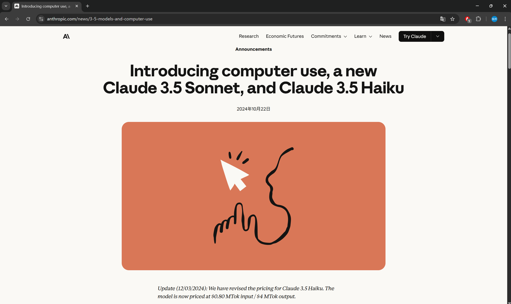

#### OpenAI

OpenAI 于 2025 年 1 月发布了闭源 GUI Agent，像人类一样与屏幕上的按钮、菜单和文本进行交互，无需使用操作系统或网络特定的 API。该产品为研究预览版，仅供美国的 Pro 用户使用。 在 OSWorld 测试集上的准确率为 38.1%。

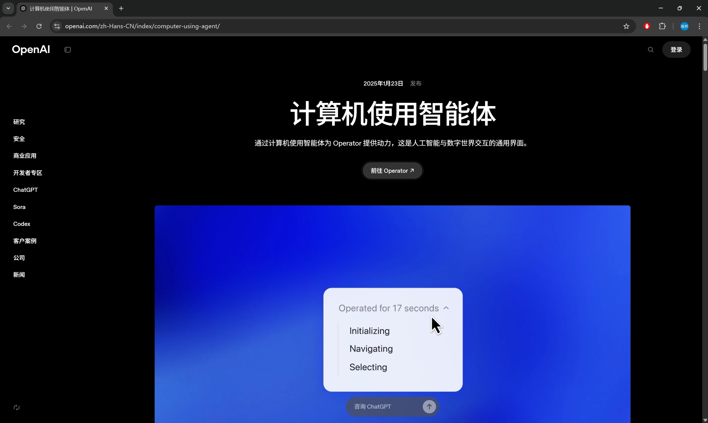

#### Google

谷歌于 2025 年 10 月发布了 GUI Agent，这是基于 Gemini 2.5 Pro 构建的专用模型。该模型主要针对网页浏览器进行了优化，同时也也展现出在手机 UI 操作任务方面的潜力。目前，该产品尚未针对桌面操作系统级别的操作进行优化。

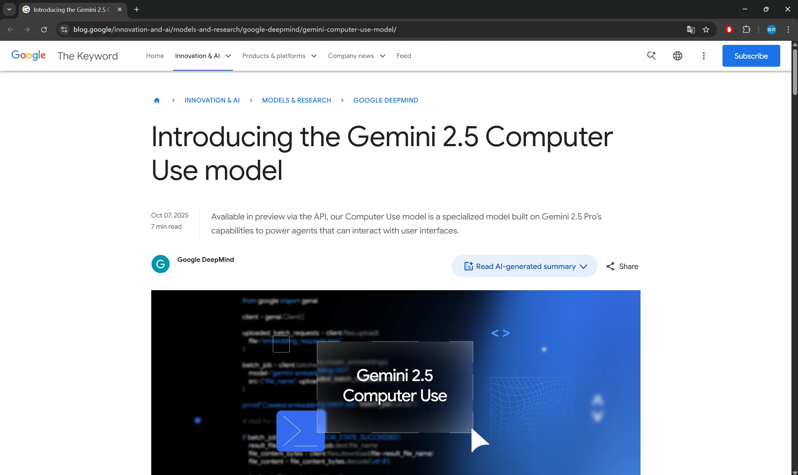

#### 智谱

智谱于 2025 年 12 月发布了 Open-AutoGLM，这是专用于手机的流程自动化智能体。

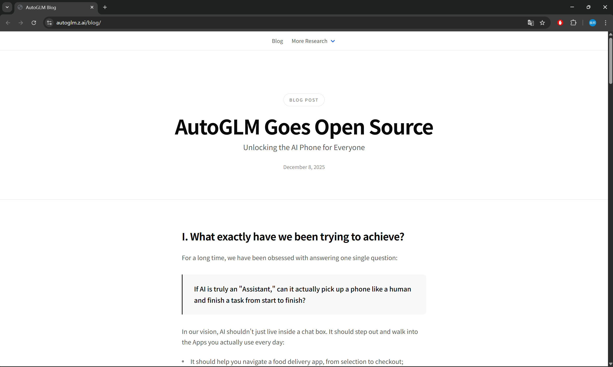

| 产品/项目              | 开发方/机构     | 地址                                                                 | Stars  | 发布时间       | 备注                 |
|------------------------|-----------------|----------------------------------------------------------------------|--------|----------------|----------------------|
| Claude Computer Use    | Anthropic       | [platform.claude.com](https://platform.claude.com/docs/en/agents-and-tools/tool-use/computer-use) | 闭源   | 2024年10月     | 最先提出           |
| Operator               | OpenAI          | [openai.com](https://openai.com/zh-Hans-CN/index/introducing-operator/) | 闭源   | 2025年1月23日  | 性能第一梯队         |
| UFO²                   | Microsoft       | [github.com/microsoft/UFO](https://github.com/microsoft/UFO)         | 7.8k   | 2025年5月6日   | Win系统深度集成      |
| UI-TARS-desktop        | ByteDance       | [github.com/bytedance/UI-TARS-desktop](https://github.com/bytedance/UI-TARS-desktop) | 19.8k  | 2025年1月23日  | 原生GUI桌面应用      |
| Open Interpreter       | Open Interpreter| [github.com/openinterpreter/open-interpreter](https://github.com/openinterpreter/open-interpreter) | 61k    | 2023年         | star数最高           |
| self-operating-computer| OthersideAI     | [github.com/OthersideAI/self-operating-computer](https://github.com/OthersideAI/self-operating-computer) | 10k    | 2023年         | 多模态操作代理       |
| OS-Copilot             | 上海AI Lab      | [github.com/OS-Copilot/OS-Copilot](https://github.com/OS-Copilot/OS-Copilot) | 1.7k   | 2024年2月      | 通用OS代理框架       |
| ShowUI                 | 新加坡国立大学  | [github.com/showlab/ShowUI](https://github.com/showlab/ShowUI)       | 1.6k   | 2024年11月     | UI视觉理解           |
| Cradle                 | 智源研究院      | [github.com/BAAI-Agents/Cradle](https://github.com/BAAI-Agents/Cradle) | 2.4k   | 2024年3月      | 通用控制框架         |
| OpenCUA                | 香港大学        | [github.com/xlang-ai/OpenCUA](https://github.com/xlang-ai/OpenCUA)   | 594    | 2025年8月      | 开源CUA实现          |
| Agent-S                | Simular AI      | [github.com/simular-ai/Agent-S](https://github.com/simular-ai/Agent-S) | 8.6k   | 2025年10月     | 搜索与学习机制       |
| AppAgent               | 腾讯            | [github.com/TencentQQGYLab/AppAgent](https://github.com/TencentQQGYLab/AppAgent) | 6.3k   | 2023年12月     | 移动端多模态         |
| MobileAgent            | 阿里            | [github.com/X-PLUG/MobileAgent](https://github.com/X-PLUG/MobileAgent) | 6.6k   | 2025年8月      | 移动端多模态         |
| AutoGLM                | 智谱华章        | [github.com/zai-org/Open-AutoGLM](https://github.com/zai-org/Open-AutoGLM) | 2.2k   | 2025年12月9日  | 移动端多模态         |
| Fara-7B                | 微软        | [github.com/microsoft/fara](https://github.com/microsoft/fara) | 3.5k   | 2025年12月24日  | Web端多模态         |

### 各 GUI Agent 的测评结果

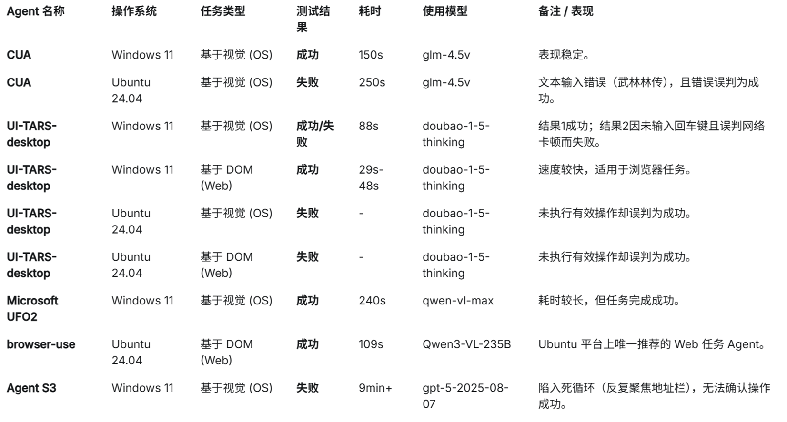

## 工作原理

根据用户的指令，GUI Agent 通过一个迭代循环将感知、推理和操作整合在一起：

- 感知：计算机的屏幕截图被添加到模型的上下文中，提供计算机当前状态的视觉快照。 
- 思考：GUI Agent 对下一步进行推理，同时考虑当前和过去的屏幕截图和操作。这种推理过程可使模型评估其观察结果、跟踪中间步骤并进行动态调整，从而提高任务性能。
- 行动：Agent 执行点击、滚动或键入等操作，直到确定任务已完成或需要用户输入。虽然它能自动处理大多数步骤，但对于敏感操作，如输入登录信息或回复验证码表单，GUI Agent 会寻求用户确认。

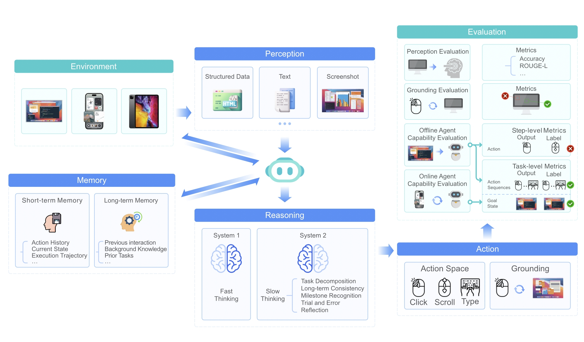

## 任务定义

给定用户的初始自然语言查询 $q_0$，GUI Agent 会根据环境状态，以多步骤的方式逐一输出动作，直到输出停止动作为止。

一条轨迹中的单个步骤 $t$ 包含三部分：
- 来自网页环境的观测（$o_t$​）
- 对当前状态进行反思、并决定下一步该做什么的思考 / 思维链（$r_t$​）
- 要执行的下一个动作（$a_t$）

一个任务对应的完整轨迹为：

$$\mathcal{T} = (q_0, \{o_0, r_0, a_0\}, \cdots, \{o_T, r_T, a_T\})$$

GUI Agent 对于步骤 $t$ 的预测：

$$P(r_t, a_t | q_0, \{o_0, r_0, a_0\}, \cdots, \{o_{t-1}, r_{t-1}, a_{t-1}\})$$

## 感知

### 基于 DOM 的

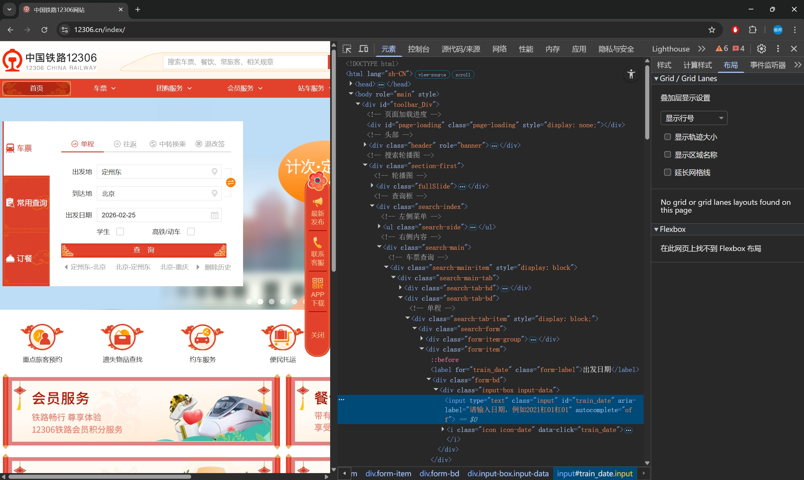

早期的 GUI Agent 受限于 LLM 只能处理文本输入的局限性。因此，这些代理依赖于将GUI页面转换为结构化的文本表示，例如HTML、可访问性树或文档对象模型（DOM）。

然而，DOM的缺点是内容过分冗余。比如，12306.cn主页的DOM文本消耗高达90万tokens。即使对DOM内容进行过滤裁剪，也需要消耗20万tokens。相比而言，一张截图仅消耗1000 tokens左右。

此外，DOM是不完备的。它不是网页的最终呈现，还受到CSS文件、业务逻辑JS代码的很大影响。

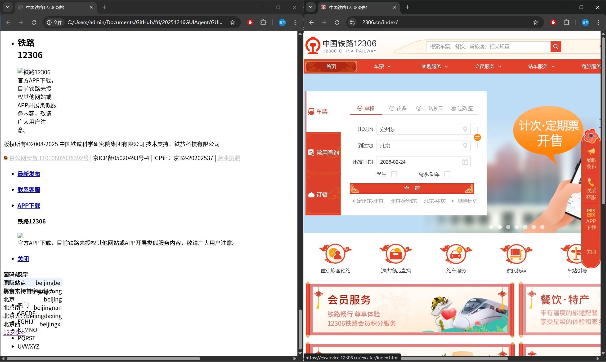

在收集操作轨迹训练数据时，图像数据具有极强的环境解耦属性，能够有效支持数据在互联网采集与内网标注平台之间的无损迁移。相比之下，单纯的DOM数据由于对外部样式资源及执行环境的强依赖性，在脱离原始网络上下文支持的情况下，无法在离线或隔离环境中精确复现原始交互界面，从而导致标注一致性的失效。

在 2025 年的一篇博客中，从技术视角分析了使用 DOM 作为感知方式的缺点。

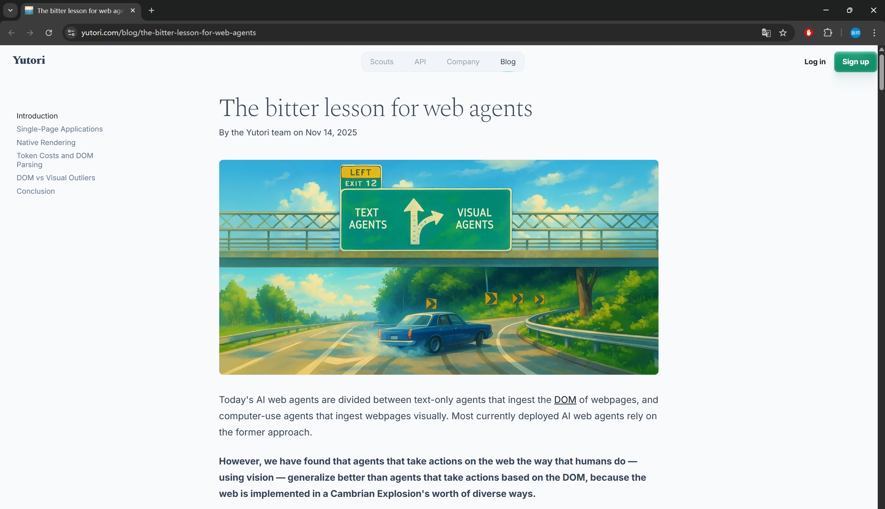

### 基于屏幕截图的

难点：GUI图像的信息密度和结构性通常比通用场景图像更高，往往包含数百个排列成复杂布局的元素。模型不仅要识别单个元素，还要理解它们的空间关系和功能交互。此外，GUI图像中的许多元素都很小（例如，在 $1920 \times 1080$ 的屏幕截图中的一个 $10 \times 10$ 像素的图标），这使得准确感知和定位这些元素变得困难。

为了解决这一问题，我们需要构建专门的GUI数据集和训练任务，对基线模型进行微调，从而提高大模型对于屏幕截图中元素感知与定位的准确性。

## 思考与行动

大模型将屏幕截图作为观测输入，首先输出思考内容，例如网页内容或当前状态，以及下一步要采取的行动。然后，根据这些思考内容，模型输出一个以工具调用形式表示的行动。

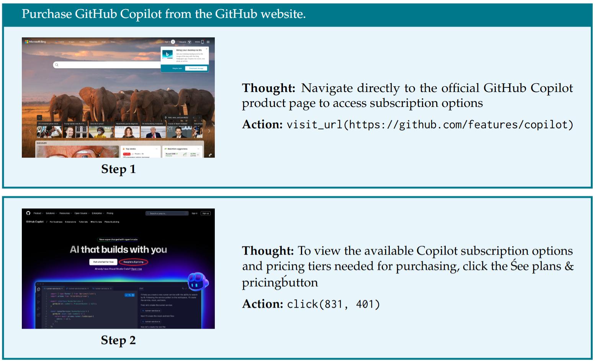

例如，用户希望 GUI Agent 自动执行任务：在 GitHub 网站上购买 Copilot 增值服务。

大模型首先观察到的是浏览器的初始界面。其思考内容是：应该导航至 GitHub Copilot 产品购买界面，然后执行对应动作。

接下来，大模型观察到已经进入到了指定页面，其思考内容是：应该点击“查看订阅计划及价格”链接。执行的动作为，点击该链接对应的坐标。

GUI Agent 能够执行的全部动作列举如下：

| 动作       | 描述                                   |
| :--------- | :------------------------------------- |
| 按键       | 按指定顺序按下按键（例如 *CTRL+C*）。  |
| 输入       | 在坐标 $(x, y)$ 处输入字符串。         |
| 移动鼠标   | 移动光标悬停在坐标 $(x, y)$ 上。       |
| 左键单击   | 在坐标 $(x, y)$ 处单击鼠标左键。       |
| 滚动       | 滚动鼠标滚轮。                         |
| 访问链接   | 访问指定的 URL。                       |
| 网络搜索   | 使用指定查询进行网络搜索。             |
| 历史回退   | 返回上一页。                           |
| 记忆       | 记忆信息以供将来参考。                 |
| 等待       | 等待指定的秒数。                       |
| 终止       | 结束当前任务。                         |

## 记忆

GUI Agent 能够存储在后续轨迹中可能有用的重要信息。当完成任务所需的关键信息位于不同页面时（例如，比较某一商品在不同零售网站上的价格），记忆功能不可或缺。

# 训练数据集构建与模型训练

未针对流程自动化任务训练的通用模型存在如下缺点：
- 屏幕截图属于领域性很强的图像，且要定位的元素很小，通用模型表现不佳。
- 完成流程自动化任务需要领域专门知识。比如，如果大模型不知道 GitHub Copilot 的产品购买页面对应的网址，便无法完整相关流程自动化任务。

为此，需要设计多种训练任务，通过对通用模型的微调，实现流程自动化的能力。

#### 操作轨迹数据集

$$\mathcal{T} = (q_0, \{o_0, r_0, a_0\}, \cdots, \{o_T, r_T, a_T\})$$

$q_0$: 在 GitHub 网站上购买 Copilot 增值服务。

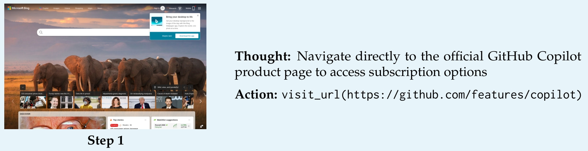
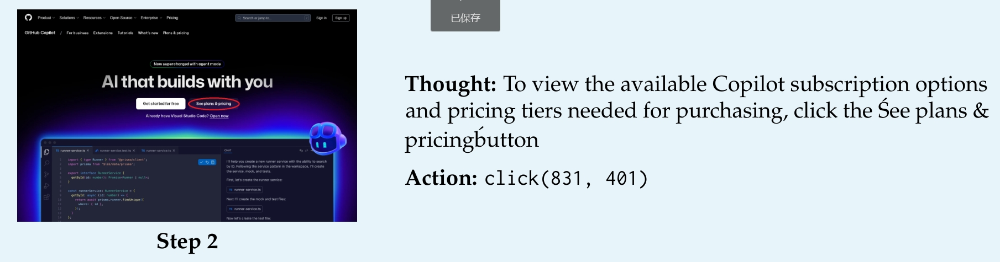
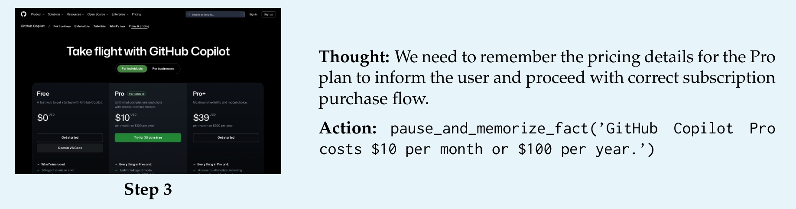
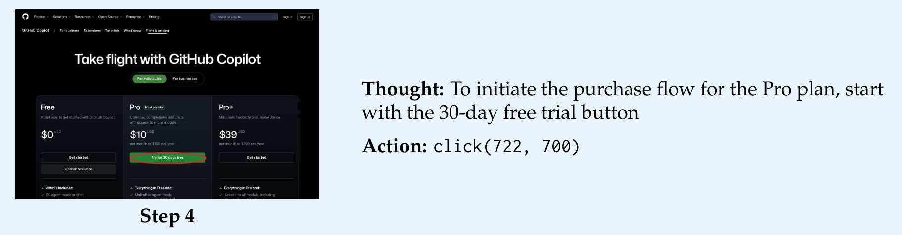
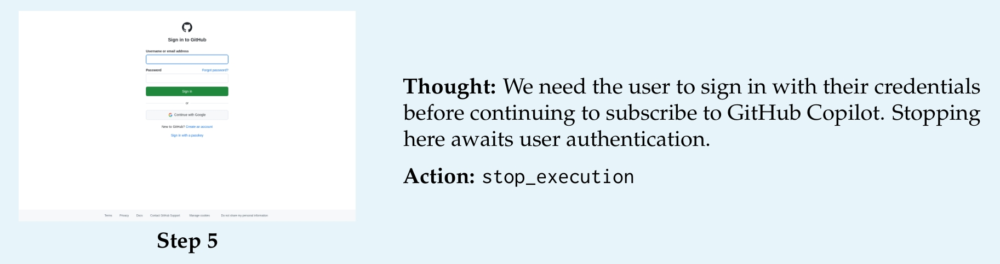

训练方式：将每条轨迹的每一步单独作为一个训练样本，把截至当前步骤的历史观测与动作作为模型输入。

使用 Qwen2.5-VL-7B 作为基座模型，并在其基础上进行监督微调（SFT）。

使用标准的交叉熵损失，所有输出都是模型词表中的 token，包括坐标。

除了轨迹数据外，训练 GUI Agent 还有要一些辅助任务，用于专项提高模型的定位和理解能力。

#### UI截图问答与描述任务

该任务用于提高模型从网页中提取信息的能力，并避免幻觉现象。

在该任务中，一条训练数据包括三部分：网页截图、用户查询、回答。

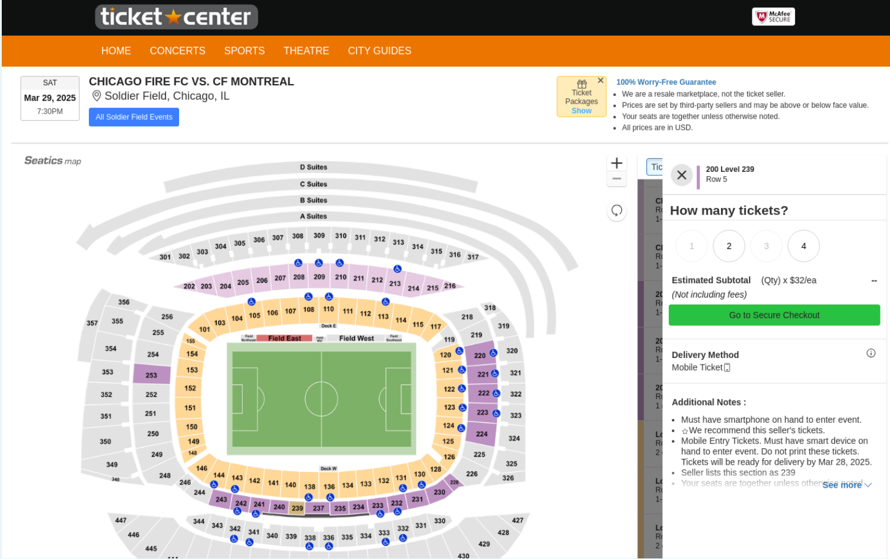

用户查询：门票的配送日期是？

回答：2025 年 3 月 28 日

#### UI定位任务

这是 GUI Agent 的一项基本子任务。目的是令模型准确识别截图中的特定元素，并能准确输出该元素的坐标。

对于UI定位任务，一条训练数据包括三部分：网页截图、用户查询、回答。

用户查询：点击衣服的 XL 尺寸

回答：click(1189, 252)

### 训练细节

- 优化器：AdamW，其参数设置为 $\beta_1 = 0.9, \beta_2 = 0.95$
- 学习率：在训练步数的前 10% 阶段采用余弦学习率预热策略；预热结束后，初始学习率设置为 $5\times 10^{-6}$
- 梯度裁剪：最大阈值设为 1
- 批次大小 = 128
- 参数精度：BF16

## 基线模型的选择

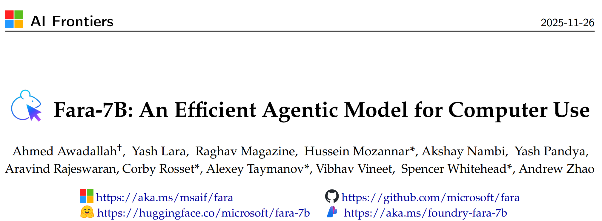

微软与2025年底提出的 Fara-7B，以 Qwen2.5-VL-7B 作为基座模型，并在其基础上进行监督微调（SFT），微调样本量为 180 万。

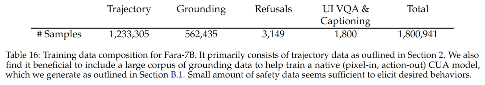

训练对于模型处理GUI自动化任务具有关键作用。

与 Fara-7B 类似的模型是 UI-Tars-1.5-7B。两者性能接近，但Fara-7B仅使用监督微调（SFT），而UI-TARS-1.5-7B则采用了强化学习（RL）。SFT是进一步微调的更经济的选择。

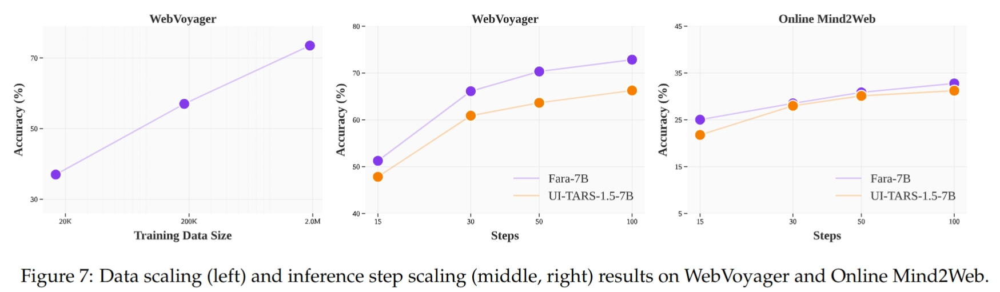

## 公安领域的模型增量微调

为提升 GUI Agent 在垂直领域的任务成功率，需构建针对公安业务场景的专用数据集，通过监督微调 (SFT) 引导模型学习特定系统的 UI 布局逻辑与业务流程。

首先，基于实际警务需求定义典型任务基准 (Benchmarks)，例如：人员身份信息核查、车辆轨迹溯源等交互任务。随后，利用基线模型自动化执行任务，评估其在公安业务系统上的初始泛化能力。

建立量化的评价体系，计算在benchmark上的任务成功率 (SR)。识别模型在视觉定位、意图推理或长序列决策中的性能瓶颈。

针对模型失效的任务，由标注员进行规范化操作，录制纠正的操作轨迹。该过程不仅捕捉屏幕截图与点击坐标，还需通过思维链（CoT）标注，显式记录每步操作背后的思考过程，从而构建高质量的专家演示数据集。

利用 SFT（监督微调）技术，引导模型学习公安业务系统的特有交互模式。

## 总结：各种流程自动化方案的优缺点及适用场景

### 基于 DOM 的 Web Agent

直接读取网页源代码（DOM）进行分析与操作。

优点
- 能够获取网页全文、原始图像链接。
- 处理浮动元素时有优势。

缺点
- DOM 树通常非常庞大，会导致 Token 消耗极快。
- 难以针对特定网站收集训练数据并微调。

### 基于视觉感知的 GUI Agent

像人类一样“看”屏幕截图，通过坐标模拟点击。

优点
- 相比DOM，截图消耗的tokens数更少。
- 易于针对特定网站收集数据集并训练。

缺点
- 截图采样存在延迟，难以处理具有浮动元素的网页。
- 处理网页中的长文本和图像时不如DOM便利。

### AI + RPA

利用 AI 自动生成 RPA 脚本，由传统 RPA 引擎执行。

优点
- 可验证性：生成的脚本可由人工审核优化，确保上线前的准确性。
- 运行高效：一旦脚本生成，执行阶段不再依赖大模型推理，速度极快且成本极低。

缺点
- 网站语义地图的构建难度：网页元素的抽象建模领域专业知识。即使想通过大模型进行构建，依然缺乏初始的专家知识。

### 传统流程自动化

固定规则编写的自动化程序。

优点
- 稳定：在预设路径下，成功率接近 100%，速度最快。

缺点
- 异常处理能力差：缺乏灵活性，遇到计划外的弹窗、广告或微小改动即会崩溃。
- 可复用性极低：每一个任务都需要单独开发，无法规模化。

### 场景与技术方案的匹配

#### 高频重复、定义明确、速度要求高、AI算力受限的任务

- 方案：自动化脚本
- 理由：脚本一旦生成（并经过人工确认），运行速度最快且稳定，不需要为每一步支付 AI 推理费用。

#### 需求模糊、任务随机

- 方案：基于 DOM 或视觉的 GUI Agent
- 理由：无需（也无法）预先编写流程自动化脚本。

#### 图文数据抓取任务

- 方案：基于 DOM 的 Web Agent
- 理由：不通过OCR便可获取网页全量文本内容，且能获取在视觉上隐藏的图像下载链接。

#### 针对特定系统构建数据集并微调

- 方案：基于视觉的 GUI Agent
- 理由：通过截图，持续收集 Agent 运行时的交互数据，可以不断微调模型，让模型在特定网站的操作越来越精准。

## 基于 Agent 调度的自适应 Web 自动化架构

当任务启动时，负责任务调度的 Agent 首先执行资源检索，若发现存在与当前站点及任务相匹配的现成流程自动化脚本，则直接调用，从而确保较高的响应速度与稳定性。在缺乏现成脚本但拥有该站点“语义地图”的情况下，Agent 会利用预存的网页元素映射关系，以组装积木的方式即时构建出针对性的流程自动化脚本。

针对从未接触过的全新站点，系统则会自动切换至自主感知模式。此时，DOM Agent 与视觉 GUI Agent 协同工作，利用多模态大模型实时解析网页结构并识别交互元素，确保系统具备在任何未知环境下从零开始完成任务的能力，从而扩展了自动化的通用性。