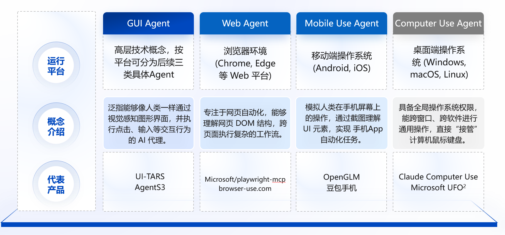

# 什么是 GUI Agent

用户通过自然语言提出任务，AI自动操作电脑应用、手机APP、Web应用。

意义：交互方式的变化

# 发展历史

## RPA

流程自动化的典型产品形态为 RPA (Robotic Process Automation)，通过模拟人类在计算机界面上的操作逻辑，在不改变企业现有 IT 架构的前提下，实现跨系统、跨平台的业务衔接，能够极大地提升数据流转的效率与精准度。

### UiPath

2005年，UiPath公司成立。全球RPA行业领军企业，提供自动化平台。帮助企业处理重复性办公任务。市值70亿美元。

### RPA 术语提出

2012年，Prism 公司正式提出RPA术语。该行业进入黄金期，大量金融企业使用RPA系统处理银行账单与表格。

### 国产 RPA

2019年，国产RPA产品影刀RPA诞生。广泛应用于电商行业，完成自动上架上品、批量抓取竞品价格等任务。

## 浏览器自动化

RPA软件的核心技术之一是浏览器自动化技术，用于模拟人类用户在Web环境下的交互行为，实现复杂业务流程的自动化处理。

### Selenium

成立于2004年，老牌Web自动化工具，目前网页自动化测试及任务处理领域最权威的全球行业标准。

### Puppeteer

2017年由谷歌推出。基于Chrome DevTools Protocol (CDP)，能够以极高的效率和稳定性控制 Chrome 浏览器。

### Playwright

由微软发布，由原 Puppeteer 团队打造，支持跨浏览器的统一自动化，解决多窗口、异步加载等待等痛点。

## GUI Agent

什么是GUI Agent？

### 与传统自动化（RPA/浏览器自动化脚本）的区别

| 特性         | 传统自动化 (RPA/Selenium)                         | GUI Agent (AI)                                       |
| :----------- | :------------------------------------------------ | :--------------------------------------------------- |
| 依赖基础     | 依赖底层代码（HTML ID, DOM 结构）或固定坐标       | 依赖视觉图像，像人眼一样看                           |
| 适应性       | 极差。一旦 UI 改版或按钮位置移动，脚本就会报错    | 强。按钮换了位置或颜色，AI 依然认得那是"提交"按钮   |
| 通用性       | 专用的。针对特定软件编写特定脚本                  | 通用的。同一个 Agent 可以学着用 Excel，也可以学着用 Photoshop |
| 指令理解     | 只能执行预设的死命令                              | 可以理解自然语言指令（模糊指令）                     |
| 处理异常     | 遇到未预设的弹窗通常会崩溃                        | 可以根据弹窗内容尝试解决或绕过                       |

### 发展现状

| 产品/项目              | 开发方/机构     | 地址                                                                 | Stars  | 发布时间       | 备注                 |
|------------------------|-----------------|----------------------------------------------------------------------|--------|----------------|----------------------|
| Claude Computer Use    | Anthropic       | [platform.claude.com](https://platform.claude.com/docs/en/agents-and-tools/tool-use/computer-use) | 闭源   | 2024年10月     | 性能第一梯队           |
| Operator               | OpenAI          | [openai.com](https://openai.com/zh-Hans-CN/index/introducing-operator/) | 闭源   | 2025年1月23日  | 性能第一梯队         |
| UFO²                   | Microsoft       | [github.com/microsoft/UFO](https://github.com/microsoft/UFO)         | 7.8k   | 2025年5月6日   | Win系统深度集成      |
| UI-TARS-desktop        | ByteDance       | [github.com/bytedance/UI-TARS-desktop](https://github.com/bytedance/UI-TARS-desktop) | 19.8k  | 2025年1月23日  | 原生GUI桌面应用      |
| Open Interpreter       | Open Interpreter| [github.com/openinterpreter/open-interpreter](https://github.com/openinterpreter/open-interpreter) | 61k    | 2023年         | star数最高           |
| self-operating-computer| OthersideAI     | [github.com/OthersideAI/self-operating-computer](https://github.com/OthersideAI/self-operating-computer) | 10k    | 2023年         | 多模态操作代理       |
| OS-Copilot             | 上海AI Lab      | [github.com/OS-Copilot/OS-Copilot](https://github.com/OS-Copilot/OS-Copilot) | 1.7k   | 2024年2月      | 通用OS代理框架       |
| ShowUI                 | 新加坡国立大学  | [github.com/showlab/ShowUI](https://github.com/showlab/ShowUI)       | 1.6k   | 2024年11月     | UI视觉理解           |
| Cradle                 | 智源研究院      | [github.com/BAAI-Agents/Cradle](https://github.com/BAAI-Agents/Cradle) | 2.4k   | 2024年3月      | 通用控制框架         |
| OpenCUA                | 香港大学        | [github.com/xlang-ai/OpenCUA](https://github.com/xlang-ai/OpenCUA)   | 594    | 2025年8月      | 开源CUA实现          |
| Agent-S                | Simular AI      | [github.com/simular-ai/Agent-S](https://github.com/simular-ai/Agent-S) | 8.6k   | 2025年10月     | 搜索与学习机制       |
| AppAgent               | 腾讯            | [github.com/TencentQQGYLab/AppAgent](https://github.com/TencentQQGYLab/AppAgent) | 6.3k   | 2023年12月     | 移动端多模态         |
| MobileAgent            | 阿里            | [github.com/X-PLUG/MobileAgent](https://github.com/X-PLUG/MobileAgent) | 6.6k   | 2025年8月      | 移动端多模态         |
| AutoGLM                | 智谱华章        | [github.com/zai-org/Open-AutoGLM](https://github.com/zai-org/Open-AutoGLM) | 2.2k   | 2025年12月9日  | 移动端多模态         |
| Fara-7B                | 微软        | [github.com/microsoft/fara](https://github.com/microsoft/fara) | 3.5k   | 2025年12月24日  | Web端多模态         |

### 各 GUI Agent 的测评结果

# 实现方式

感知、思考、行动。

## 感知

### 基于 DOM 的

### 基于截图的

截图

## 思考

大模型的能力

## 行动

| 动作       | 描述                                   |
| :--------- | :------------------------------------- |
| 按键       | 按指定顺序按下按键（例如 *CTRL+C*）。  |
| 输入       | 在坐标 $(x, y)$ 处输入字符串。         |
| 移动鼠标   | 移动光标悬停在坐标 $(x, y)$ 上。       |
| 左键单击   | 在坐标 $(x, y)$ 处单击鼠标左键。       |
| 滚动       | 滚动鼠标滚轮。                         |
| 访问链接   | 访问指定的 URL。                       |
| 网络搜索   | 使用指定查询进行网络搜索。             |
| 历史回退   | 返回上一页。                           |
| 记忆       | 记忆信息以供将来参考。                 |
| 等待       | 等待指定的秒数。                       |
| 终止       | 结束当前任务。                         |

# 训练数据集的构建与模型的训练

#### 轨迹任务

将每条轨迹的每一步单独作为一个训练样本，把截至当前步骤的历史观测与动作作为模型输入。

我们采用 Qwen2.5-VL 的定位规范，并预测绝对坐标。我们使用标准的交叉熵损失，所有输出都是模型词表中的 token，包括坐标。

#### UI问答任务

一条训练数据包括三部分：
- 截图
- 问题
- 回答

问题：门票的配送日期是？

回答：2025 年 3 月 28 日

#### UI定位任务

一条训练数据包括三部分：
- 截图
- 问题
- 回答

问题：点击衣服的 XL 尺寸

回答：click(1189, 252)

### 训练细节

我们使用 Qwen2.5-VL-7B 作为基座模型，并在其基础上进行监督微调（SFT）。

我们使用标准的交叉熵损失，所有输出都是模型词表中的 token，包括坐标。

把每一步单独切成一条训练数据。

对于轨迹数据，我们将每条轨迹的每一步单独作为一个训练样本，把截至当前步骤的历史观测与动作作为模型输入。

- 优化器：AdamW，其参数设置为 $\beta_1 = 0.9, \beta_2 = 0.95$
- 学习率：在训练步数的前 10% 阶段采用余弦学习率预热策略；预热结束后，初始学习率设置为 $5\times 10^{-6}$
- 梯度裁剪：最大阈值设为 1
- 批次大小 = 128
- 参数精度：BF16
